# 一、走进Java

## 计算机语言概述

### 人类语言

人与人之间沟通的语言。

计算机语言

人与计算机沟通用的语言。

### Java语言

Java EE ：（企业版）为开发企业环境下的应用程序提供的一套解决方案。主要针对Web应用程序开发。

Java SE：（标准版）为开发普通桌面及商务应用提供的解决方案。该技术体系为其他两者的基础，可完成一些桌面应用程序的开发。

Java ME：（小型版）：为开发电子消费产品和嵌入式设备提供的解决方案。比如手机app。

### Java的特性

**跨平台性**：JVM就是Java Virtual Machine，即Java虚拟机，让Java编写的程序可以运行在不同平台的操作系统上。


## Java的环境搭建

### JRE（Java Runtime Environment即Java运行环境）

包括**JVM**和Java程序所需的**核心类库**。如果只需要运行Java程序，则只需安装JRE即可。

### JDK（Java Development Kit即Java开发工具包）

包括Java的开发工具（编译工具javac.exe，打包工具jar.exe等）和JRE。安装JDK后就不用再安装JRE。

### 安装JDK

1. 登录www.oracle.com
2. 
3. Java——JDK——download
4. 下载历史版本：download选项卡最下端Java Archive中有各个历史版本下载。
5. 可以安装到移动硬盘等硬件上，随时可用。
6. bin（binary）目录中存放的是一些开发工具

### windows dos 命令行

dir (directory) ：列出当前目录下的文件以及文件夹

md (make directory)： 创建目录

rd (remove directory)：删除目录    windows系统中，目录为空才可删除目录，最早可追溯到dos系统时，为了防												止误删文件。

cd (change directory)：进入指定目录

cd.. : 退回到上一级目录

cd\ : 退回到根目录

del：删除文件

exit：退出dos命令行

cls (clear screen): 清屏


有关某个命令的详细信息，请键入help 命令名

```java
help cd //具体查看某个命令行命令的用法
```


## 配置环境变量

### 环境变量

变量名：JAVA_HOME 

变量值：C:\Program Files\Java\jdk1.8.0_66  （自己安装的jdk  安装目录）


变量名：CLASSPATH   （java 1.5及之后的版本中不用再去配置classpath）**将Java的运行文件（.class文件）所在路径告诉系统，虚拟机在执行时会按照指定的classpath路径去查找并执行类文件。如果没有配置classpath，虚拟机就会在当前路径查找类文件。虚拟机会优先执行classpath路径中的文件。**

变量值：.;%JAVA_HOME%\lib\dt.jar;%JAVA_HOME%\lib\tools.jar    （前面的**.**是需要添加上的）

**“.”代表当前路径，>前面的就是当前路径**

在classpath路径值结尾处加“;”也能起到同样的作用，JVM会在classpath无法找到文件时在当前路径寻找可执行文件，但这种方式是隐性的表达，可读性不强，所以一般采用“.”来代表当前目录。

**注**

在JDK1.5以后，classpath并不是必须配置了，在JDK1.5之前，是没有办法在当前目录下加载类的（找不到 JDK目录下lib文件夹中的.jar文件），所以我们需要通过配置classpath，但JDK1.5之后，JRE能自动搜索目录下类文件，并且加载dt.jar和tool.jar的类。

 rt.jar和tool.jar这两种属于java平台自身的包就不需要添加到classpath中，只有一些第三方类或者自定义类需要，也并不推荐使用配置CLASSPATH的方法，更推荐使用-classpath选项 


变量名：Path 

变量值：%JAVA_HOME%\bin;%JAVA_HOME%\jre\bin;  

#### 配置环境变量的原理与技巧

Path存放了系统中应用程序所在的路径，比如记事本、计算器等。

用命令行打开某个应用程序时，系统会先检索当前所在目录是否有该应用程序，如果没有，就会去path所包含路径中去检索，从而无需我们每次都进入想要运行的程序所在的目录，避免了重复的操作。

编辑path环境变量，在变量值开始处加上java工具所在目录，后面用 “ ; ”和其他值分隔开即可。
打开DOS命令行，任意目录下敲入javac。
如果出现javac 的参数信息，配置成功。

为了不因为jdk的目录或者目录名称的改变，而不断更改path的值，而导致对path变量值的误操作，可以通过以下技巧完成。
新创建一个环境变量 JAVA_HOME 记录住jdk的目录。
在path中通过%%动态的获取JAVA_HOME的值即可。
JAVA_HOME=F:\jdk1.6.0_01
path=%JAVA_HOME%\bin;%path%
%path%：动态获取path环境变量的值。
%JAVA_HOME%：动态获取名称为JAVA_HOME环境变量的值。、


**临时设置环境变量**

```java
set path

//查看path值

set path=abc

//设置path值为abc，仅在该命令提示符工具窗口中有用

set path=

//设置path值为空，即删除path值

set path=abc;%path%

//配置path值为abc和原本的path值，即在原本path值基础上增加abc
```


### 配置方式

我的电脑--属性--高级--环境变量


## Hello World！


### 步骤一：编写

- 选择最简单的编辑器记事本。

- 敲入代码

  ```java
  class Demo
  {
      
  }
  ```

  

- 将文件保存成Demo.java，这个文件是存放java代
  码的文件，称为源文件。

### 步骤二：编译

- 有了java源文件，将其编译成JVM可以识别的文件。
- 在该源文件目录下，通过javac编译工具对Demo.java文件进行编译（可以用命令行运行javac）。

**注：javac是对外提供的一个启动命令，它底层对应着一整套java编译程序。启动后会先对源代码进行检查，如果有错误，则会有报错**

- 如果程序没有错误，没有任何提示，但在当前目录下会
  出现一个Demo.class文件，该文件称为字节码文件，也
  是可以执行的java的程序。

### 步骤三：运行

- 有了可执行的java程序(Demo.class字节码文件)，通过运行工具java.exe对字节码文件进行执行。运行java.exe就会启动JVM。
  
- 出现提示：该错误为：缺少一个名称为main的方法。
  
- 

  原因：因为java 命令后面的文件不能有后缀名

- 

  去掉扩展名.class即可运行成功


**例：**

```java
//第一步，定义类
class Cock{
	//第二步，为了让类能够独立运行，建立一个主函数
    public static void main(String[] args){
        //第三步，写了输出语句，计算机进行互动
		System.out.println("Hello World!");
	}
}
```


**注：**

- **main函数是虚拟机调用程序的入口，有了main函数就能保证一个class的独立运行。一个class中有且只能有一个main函数。**
- java命令底层对应的应用程序是JVM。

- 因为一个程序的执行需要一个起始点或者入口，所以在Demo类中的加入`public static void main(String[] args){}`

- 对修改后的Demo.java源文件需要重新编译，生成新的class文件后，再进行执行。

- 发现没有编译失败，但也没有任何效果，因为并没有告诉JVM要帮我们
  做什么事情，也就是没有可以具体执行的语句。
  
- 想要和JVM来个互动，只要在main方法中加入一句``System.out.println("hello java")`;在重新编译，运行即可。

  


# 二、Java语言基础

## Java语言组成


**学习目的：学会这些基本元素的格式；知道该什么时候用**

## 关键字


## 标识符

**定义：**在程序中自定义的一些名称。由26个英文字母大小写，数字： 0-9 符号： _ $ 组成

**定义合法标识符规则**：

1. 数字不可以开头。
2. 不可以使用关键字。Java中严格区分大小写。

注：在起名字的时，为了提高阅读性，要尽量有意
义。

## 注释

提高了代码的阅读性。用来注解程序，也可用来调试程序。
Java中的注释格式：

**单行注释**
格式： //注释文字

单行注释中可以嵌套单行和多行注释

**多行注释**
格式： /* 注释文字 */

多行注释中再加多行注释会将遇到的第一个多行注释结束符号后的内容排除出注释之外。

**文档注释**
格式： /** 注释文字 */

- 对于单行和多行注释，被注释的文字，不会被JVM（java虚拟机）解释执行。
- 对于文档注释，是java特有的注释，其中注释内容可以被JDK提供的工具 javadoc 所解析，生成一套以网页文件形式体现的该程序的说明文档。
- 注释是一个程序员必须要具有的良好编程习惯。
- 初学者编写程序可以养成习惯：先写注释再写代码。
- 将自己的思想通过注释先整理出来，在用代码去体现。因为代码仅仅是思想的一种体现形式而已。

## 常量与变量

### 常量

**常量**表示不能改变的数值。
**Java中常量的分类：**

1. 整数常量。所有整数
2. 小数常量。所有小数
3. 布尔型常量。较为特有，只有两个数值。 true false。
4. 字符常量。将一个数字字母或者符号用单引号( ' ' )标识。
5. 字符串常量。将一个或者多个字符用双引号标识。
6. null常量。只有一个数值就是:null.

**对于整数： java有三种表现形式。**

- 十进制： 0-9 ，满10进1
-  八进制： 0-7 ，满8进1. 用0开头表示。
- 十六进制： 0-9， A-F，满16进1. 用0x开头表示。

#### **进制的基本转换：**

- 十进制 二进制 互转
  - 十进制转成二进制 ：
  - 二进制转成十进制 乘以2的幂数
- 十进制 八进制 互转
- 十进制 十六进制 互转

**十进制数转换为任意进制数的方法**

将该十进制数不断除以要转换成的进制数（如：二进制就除以2，八进制就除以8），记录下余数（余数肯定是小于进制数的），此余数即为进制转换之后的数字的最低位，再用得到的商除以进制数，记录下余数，此余数即为进制转换之后的数字的倒数第二位，重复此步骤，直至最后得到的商小于进制数为止，将得到的余数按上文所说顺序记录，最后一次除法运算得到的商，即为该转换后数字的最高位。

**任意进制数转换为十进制的方法**

无论一个数字用何种进制表示，它所代表的实际意义是不变的。任意进制的任意两位之间的关系都是次方关系，次方根就是进制数，这两个数位上的数字，表示这个数字想要表达的概念中，有多少个该位代表的进制数的次方。任意进制的第一位，也就是最低位，都是个位，也就是该进制数的0次方。所以，例如一个8位的十六进制数字，它的第八位的基本单位就是16^7。因此，要将任意进制数转换为十进制数，只需将该进制数的每个数位代表的数字按照十进制乘法的规则计算出来，再计算出各个数字的和即可。

**任意两种进制之间的转换**

目前为止还没想到更简单直接的方式，因为懒得想了，感冒之后脑子转不动。所以就先用笨办法吧，就是将现有进制先转换为二进制或十进制，再转换为目标进制吧。

- 负数的二进制表现形式
  - 对应的正数二进制取反加1（取反：0、1互换）


*Fun Fact：IPv4就是由四个字节分四段表示一个ip地址的方式，IPv6就是六个字节表示一个ip地址。*

**byte是计算机用于计量存储容量的一种基本1计量单位。**

**1byte=8bit（二进制位）**


八进制数，其实就是二进制中的三个二进制位为一个八进制位。

十六进制数，其实就是二进制中的四个二进制位为一个十六进制数。


**负数**


6在内存中以4个字节存储

### 变量

- **变量的概念：** 
  - 内存（运行速度比硬盘快）中的一个存储区域
  - 该区域有自己的名称（变量名）和类型（数据类型）
  - 该区域的数据可以在同一类型范围内不断变化。

- **为什么要定义变量：**
  - 用来不断的存放同一类型的常量，并可以重复使用

- **使用变量注意：**
  - 变量的作用范围（一对{}之间有效）
  - 初始化值

- **什么时候使用变量：**
  - 当数据不确定时

- **定义变量的格式：**
  - 数据类型 变量名 = 初始化值；
  - 注：格式是固定的，记住格式，以不变应万变。
- **理解：变量就如同数学中的未知数。**

### Java数据类型


#### Java语言提供了八种基本类型

六种数字类型（四个整数型，两个浮点型，主要区别为分配的内存空间大小不同），一种字符类型，还有一种布尔型。

补充：bit是表示信息的最小单位，是二进制数的一位包含的信息或两个选项0和1特别指定的一个所需的信息量。

**byte：**

- byte 数据类型是8位、有符号的，以二进制补码表示的整数；
- 最小值是 **-128（-2^7）**；
- 最大值是 **127（2^7-1）**；
- 默认值是 **0**；
- byte 类型用在大型数组中节约空间，主要代替整数，因为 byte 变量占用的空间只有 int 类型的四分之一；
- 例子：byte a = 100，byte b = -50。

**short：**

- short 数据类型是 16 位、有符号的以二进制补码表示的整数
- 最小值是 **-32768（-2^15）**；
- 最大值是 **32767（2^15 - 1）**；
- Short 数据类型也可以像 byte 那样节省空间。一个short变量是int型变量所占空间的二分之一；
- 默认值是 **0**；
- 例子：short s = 1000，short r = -20000。

**int：**

- int 数据类型是32位、有符号的以二进制补码表示的整数；
- 最小值是 **-2,147,483,648（-2^31）**；
- 最大值是 **2,147,483,647（2^31 - 1）**；
- 一般地整型变量（整数）默认为 int 类型；
- 默认值是 **0** ；
- 例子：int a = 100000, int b = -200000。

**long：**

- long 数据类型是 64 位、有符号的以二进制补码表示的整数；
- 最小值是 **-9,223,372,036,854,775,808（-2^63）**；
- 最大值是 **9,223,372,036,854,775,807（2^63 -1）**；
- 这种类型主要使用在需要比较大整数的系统上；
- 默认值是 **0L**；
- 例子： long a = 100000L，Long b = -200000L。
  "L"理论上不分大小写，但是若写成"l"容易与数字"1"混淆，不容易分辩。所以最好大写。

**float：**

- float 数据类型是单精度、32位、符合IEEE 754标准的浮点数；
- float 在储存大型浮点数组的时候可节省内存空间；
- 默认值是 **0.0f**；
- 浮点数不能用来表示精确的值，如货币；
- 例子：float f1 = 234.5f。

**double：**

- double 数据类型是双精度、64 位、符合IEEE 754标准的浮点数；
- 浮点数的默认类型为double类型；
- double类型同样不能表示精确的值，如货币；
- 默认值是 **0.0d**；
- 例子：double d1 = 123.4。

**boolean：**

- boolean数据类型表示一位的信息；
- 只有两个取值：true 和 false；
- 这种类型只作为一种标志来记录 true/false 情况；
- 默认值是 **false**；
- 例子：boolean one = true。

**char：**

- char类型是一个单一的 16 位 Unicode 字符；
- 最小值是 **\u0000**（即为0）；
- 最大值是 **\uffff**（即为65,535）；
- char 数据类型可以储存任何字符；
- 例子：char letter = 'A';。


**案例：**

```java
class VarDemo 
{
	public static void main(String[] args) 
	{
		//数据类型    变量名  =  初始化值;
			byte	b = 3;
			short s = 4000;
			int x = 12;
			long l = 123l;//在123末尾加一个英文字母“l”

			float f = 2.3f;//在后面加上f表示该数字是float型的，如果不写的默认的是double型。同理，加								上l表示long型

			double d = 3.4;

			char ch = '1';

			boolean bl = true;
			bl = false;
			
		{
			int z = 9;
			System.out.println(z);//z只在大括号范围内有用，在括号范围外无法调用z
		}
			
		System.out.println(z);

		//System.out.println(y);
	}
}

```

#### 三种引用数据类型

#### 补充：原码、反码、补码

**原码**
原码比较好理解，也就是该数字不进行其他操作时数字最原始的二进制表示，在Java中我们有熟悉的byte,short,int,long的整数型基本数据类型以及float,double的浮点型基本数据类型。 
在Java中，对于整数而言，其原码格式为最高位为符号位，该位上1表示负数而0表示正数，剩余位数为该数字的二进制表示。在这里我们简单用int型的整数5及-5看下例子： 
5的原码：00000000 00000000 00000000 00000101 
-5的原码:10000000 00000000 00000000 00000101 
因此，对于原码来说，绝对值相等的正数和负数只有符号位不同。

**反码**
从反码开始略有些复杂了，正数的原码即为其反码，对于负数而言只需要将原码除符号位以外的位数取反（如果为0改为1，如果为1改为0），便得到了当前负数的反码。 
我们依旧拿数字5举例： 
5的反码：00000000 00000000 00000000 00000101 
-5的反码：11111111 11111111 11111111 11111010

**补码**
明白了反码的规则，补码的表示方法就很简单了，正数的原码即为其补码，负数的补码是上面取得的反码加1。 
5的补码：00000000 00000000 00000000 00000101 

-5的补码：11111111 11111111 11111111 11111011

**总结：**

正数：原码、反码、补码相同。 
负数：反码符号位不变化，其余位数取反,补码即为反码+1。


**补码原理：**二进制用最高为表示符号位，0 表示正数，1 表示负数。得到一个负数，要使用二进制的**补数**。将二进制的各数位全部取反，然后再将结果加 1，就得到了负数。

所以补数的变化方法就是 “取反+1”。对补数再次求补数，得到原来的值，好比**负负得正**。例如十进制 1 用二进制表示就是 0000 0001, 取反+1 后得到 (1最高位溢出会被忽略)1111 1111，这个数就表示 -1，如果对 1111 1111 再次 取反+1 ，又得到 0000 0001，即 1 。补数的思考方式是 1+(-1) = 0 这一基本运算法则。用 0000 0000 减去 0000 0001 便能得到 1111 1111 (最高位溢出被忽略)。所以一个数的补数与原来的值相加，结果为 0。

有了便于计算的补数，计算机再做减法的时候，就可以转换为加法运算，比如 2 – 3，可以转为为 2 + (-3) ，-3 即 3 的补数，也就是 0000 0010 + 1111 1101 (0000 0011 的补数，表示 -3) ，相加后结果为 1111 1111 ，最高位为 1，表示这个数是负数，根据前边的例子我们知道，这个数表示十进制的 -1。如果不知道一个负数具体是多少，可以先求它的补数，例如 1111 1111 的补数是 0000 0001 (表示 1)，因为是原值为负数，所以原值为十进制的 -1。

知道了符号位，我们再做二进制右移运算时，空出的多余高位，全部用符号位补齐即可。

**Java中所有基本数据类型均使用该数字的补码进行表示**，所以再运算结束后，会将补码转换为原码再转换为我们声明的十进制数据类型，所以在Java中测试5与-5的输出我们能看到这样的结果：

```java
 	int i = 5;
    int j = -5;
    System.out.println(Integer.toBinaryString(i));
    //101  之前的29位全0被忽略了

    System.out.println(Integer.toBinaryString(j));
    //11111111111111111111111111111011
```


**例子：**

一个byte型数据，它在计算机中占8位，-9可以表示为10001001，最高位的1代表负号，它的反码是除去符号位各位取反为11110110，然后加1得到补码11110111。8的二进制表示为00001000，现在我们运算8 - 9，在计算机并不是用8减去9，而是用8 + (-9)，也就是用8的补码00001000加上-9的补码11110111，两个有符号数相加，如果符号位相加有近位就删去符号位的进位，得到结果的补码11111111，减去1，并取反得到运算结果的原码（第一位为符号位，不取反）10000001，也就是-1。


#### 自动类型转换、强制类型转换与自动类型提升

**例**

```java
byte b = 4;
b = 3+7;/*可以正常运算，因为3和7都是常量，为int型，jvm判断3和7的和10仍在byte型表达范围之内，可以转换且不丢失精度，所以运算成功*/
byte b1 = 3;
byte b2 = 7;
b=b1+b2;/*无法运算。因为b1和b2都是变量，它们的值是会改变的，当二者的值增大，导致二者之和超出byte类型表达范围时，将二者之和转换为byte类型将会丢失精度，jvm无法判断两个变量之和到底是否会超出byte类型的范围，所以会报错，无法运算。*/
```


**自动类型转换（隐式类型转换）：**数字表示范围小的数据类型可以自动转换成范围大的数据类型。


实线表示自动转换时不会造成数据丢失，虚线则可能会出现数据丢失问题。

**自动转换也要小心数据溢出问题，看下面的例子。**

```java
int count = 100000000;
int price = 1999;
long totalPrice = count * price;
```

编译没任何问题，但结果却输出的是负数，这是因为两个 int 相乘得到的结果是 int, 相乘的结果超出了 int 的代表范围。这种情况，一般把第一个数据转换成范围大的数据类型再和其他的数据进行运算。

```java
int count = 100000000;
int price = 1999;
long totalPrice = (long) count * price;
```

另外，向下转换时可以直接将 int 常量字面量赋值给 byte、short、char 等数据类型，而不需要强制转换，只要该常量值不超过该类型的表示范围都能自动转换。如果超出范围，java就会从右往左截断数据。


**强制类型转换（显式类型转换）：**强制显示的把一个数据类型转换为另外一种数据类型。

如：

```java
short s = 199;
int i = s;// 199

double d = 10.24;
long ll = (long) d;// 10
```

以上的转换结果都在我们的预期之内，属于正常的转换和丢失精度的情况，下面的例子就一样属于数据溢出的情况。

```java
int ii = 300;
byte b = (byte)ii;//超出了byte的范围（-128~127）
```


**自动类型提升：**指在多种不同数据类型的表达式中，类型会自动向范围表示大的值的数据类型提升。

把上面的溢出的例子再改下：

```java
long count = 100000000;
int price = 1999;
long totalPrice = price * count;
```

price 为 int 型，count 为 long 型，运算结果为 long 型，运算结果正常，没有出现溢出的情况。


我们知道Java中基本数据类型的范围是各不相同的，因此在不同类型进行转换时，我们会经常使用诸如(int)这样的cast前缀来进行强制类型转换，一般而言在不考虑无法转换及同为数值类型的前提下，如果该数据类型的范围比目标数据类型的范围大，那么我们无需使用前缀进行强制类型转换，倘若反过来，现有数据类型的范围无法容纳较大数据类型的内容，Java便会在运行时对范围较大数进行截断。 
例如int类型比所有byte合法类型大，因此不要求显式强制类型转换。对于数字类型，整型和浮点型都是彼此兼容的，但是数字类型和字符类型和布尔类型是不兼容的，字符类型和布尔类型也不是互相兼容的。 

目标类型指定了要转换成为的类型。例如将int型转为byte型，int型取值范围大于byte型，它的值将对byte型范围进行取模。而把浮点型赋值给整数型，就会出现截断，截取掉小数部分。从其他数值类型转换为char类型时，必须进行强制转换。将char类型转换为其他数值类型时，除了byte、short必须强制转换之外，int、long、float、double都不用强制转换。（https://blog.csdn.net/weixin_37870009/article/details/79775926）


## 运算符

### 算术运算符

```java
class OperateDemo{
	/*
	算术运算符 + - * / %（取余，模运算） +（字符、字符串，起连接符的作用）
	++（自增。在初始数据上+1，再赋值给原数据）
	*/
    public static void main(String[] args){
    	int x=456;
        x=x/100*100;
        System.out.println(x);/*输出结果为400。因为456除以100等于4.56，有两位小数，而整数见进行加减乘除等运算得出的结果的默认数据类型也是整数，所以java底层会默认将0.56舍去，所以得到400*/
		int y=-5%2;
		int z=5%-2;
		System.out.println(y);//结果为-1
		System.out.println(z);//结果为1
		/*因为取模运算只考虑取模数的正负号*/
		
		int a=4;
		int b=5;
		System.out.println("a="+a+','+"b="+b);//此处的+用于连接字符和数字
		
		int i=3,d;
		i++;//i=i+1,两个步骤，先+1，再赋值给原数据
		System.out.println(i);
		i=3;
		++i;//i=i+1
		System.out.println(i);
		i=3;
		d=i++;
		System.out.println(d+","+i);
		/*结果是i=4,d=3，这是因为，在内存中运算的过程是这样的，先生成整数3，再把3赋值给i，把i的值加载到数据栈，此时i=3，栈顶值为3，运算i+1，此时i=4，将数据栈顶的
		值3取出来，赋给d*/
		i=3;
		d=++i;
		System.out.println(d+","+i);
		/*结果为d=4,i=4，在内存中的运算过程是这样的，先生成整数3，把3赋给i，运算i+1，此时i=4，把i的值加载到数据栈，栈顶值为4，最后将栈顶值取出来，赋给d*/
		
		i=3;
		i=i++;
		System.out.println(i);
		/*结果为i=3，在内存中运算的过程是这样的，先生成整数3，把3赋给i，把i的值加载到数据栈，栈顶值为3，运算i+1，此时i=4，最后把栈顶值取出来，赋给i，此时i=3*/
	}
}
    
```

#### i++和++i的实现原理

 我们从编译后的字节码层面上来了解i++和++i的实现原理，为了方便对比，笔者将这两个指令分别放在2个不同的方法中执行，源代码如下：

```java
public class Test {

    public void testIPlus() {
        int i = 0;
        int j = i++;
    }

    public void testPlusI() {
        int i = 0;
        int j = ++i;
    }

}
```

 将上面的源代码编译之后，使用`javap`命令查看编译生成的代码（忽略次要代码）如下： 

```java
...
{
  ... 

  public void testIPlus();
    descriptor: ()V
    flags: ACC_PUBLIC
    Code:
      stack=1, locals=3, args_size=1
         0: iconst_0               // 生成整数0
         1: istore_1               // 将整数0赋值给1号存储单元（即变量i）
         2: iload_1                // 将1号存储单元的值加载到数据栈（此时 i=0，栈顶值为0）
         3: iinc          1, 1     // 1号存储单元的值+1（此时 i=1）
         6: istore_2               // 将数据栈顶的值（0）取出来赋值给2号存储单元（即变量j，此时i=1，j=0）
         7: return                 // 返回时：i=1，j=0
      LineNumberTable:
        line 4: 0
        line 5: 2
        line 6: 7

  public void testPlusI();
    descriptor: ()V
    flags: ACC_PUBLIC
    Code:
      stack=1, locals=3, args_size=1
         0: iconst_0                // 生成整数0
         1: istore_1                // 将整数0赋值给1号存储单元（即变量i）
         2: iinc          1, 1      // 1号存储单元的值+1（此时 i=1）
         5: iload_1                 // 将1号存储单元的值加载到数据栈（此时 i=1，栈顶值为1）
         6: istore_2                // 将数据栈顶的值（1）取出来赋值给2号存储单元（即变量j，此时i=1，j=1）
         7: return                  // 返回时：i=1，j=1
      LineNumberTable:
        line 9: 0
        line 10: 2
        line 11: 7
}

```

##### i = i++的导致的结果“异常”

代码执行后的结果：

```java
int i = 0;
i = i++;

System.out.println("i=" + i); // 输出 i=0
```

编译后的核心代码如下：

```java
0: iconst_0                          // 生成整数0
1: istore_1                          // 将整数0赋值给1号存储单元（即变量i，i=0）
2: iload_1                           // 将1号存储单元的值加载到数据栈（此时 i=0，栈顶值为0）
3: iinc          1, 1                // 号存储单元的值+1（此时 i=1）
6: istore_1                          // 将数据栈顶的值（0）取出来赋值给1号存储单元（即变量i，此时i=0）
7: getstatic     #16                 // 下面是打印到控制台指令
10: new           #22               
13: dup
14: ldc           #24                 
16: invokespecial #26                 
19: iload_1
20: invokevirtual #29                
23: invokevirtual #33                 
26: invokevirtual #37                 
29: return
```

 

从编码指令可以看出，`i`被栈顶值所覆盖，导致最终`i`的值仍然是`i`的初始值。无论重复多少次`i = i++`操作，最终i的值都是其初始值。

 `i++`会产生这样的结果，那么`++i`又会是怎样呢？同样的代码顺序，将`i++`替换成`++i`如下：

```java
int i = 0;
i = ++i; // IDE抛出【The assignment to variable i has no effect】警告

System.out.println("i=" + i); // 输出i=1
```

 可以看到，使用`++i`时出现了“正确”的结果，同时Eclipse IDE中抛出【The assignment to variable i has no effect】警告，警告的意思是将值赋给变量i毫无作用，并不会改变i的值。也就是说：`i = ++i`等价于`++i`。

#### i++和++i的异同

```java
class Test_3{
	public static void main(String[] args){
		//verse1
		int i=0;
		i++;
		System.out.println(i);//1
		//verse2
		int k=0;
		k=k++;
		System.out.println(k);//0
		//verse3
		int j=0;
		++j;
		System.out.println(j);//1
		//verse4
		int l=0;
		l=++l;
		System.out.println(l);//1
		
		System.out.println("------------------------------");
		
		test();
		
	}
	
	/* 
		根据输出结果我们可以看出，i++不参与赋值运算的时候与参与的时候输出的结果分别为1,0,是不一样的。
		而++j的两次输出则都是1。
		结合之前所学进行分析可知上述程序的运行过程如下：
		
		verse1:
		计算机在内存中开辟1号存储单元用来存储变量i，生成整数0，赋值给1号存储单元（此时i=0），1号存储单元的值+1（此时i=1），打印i的值为1。
		verse2:
		计算机在内存中开辟1号存储单元用来存储变量k，生成整数0，赋值给1号存储单元（此时k=0），将1号存储单元的值（0）加载到数据栈，
		1号存储单元的值+1（此时k=1），将数据栈栈顶的值（0）取出来赋值给1号存储单元（此时k=0），打印k的值为0。
		
		verse3:
		计算机在内存中开辟1号存储单元用来存储变量l，生成整数0，赋值给2号存储单元（此时l=0），2号存储单元的值+1（此时l=1），打印l的值为1。
		verse4:
		计算机在内存中开辟2号存储单元用来存储变量j，生成整数0，赋值给2号存储单元（此时j=0），2号存储单元的值+1（此时j=1），
		将2号存储单元的值（1）加载到数据栈，将数据栈栈顶的值（1）取出来赋值给2号存储单元（此时j=1）,打印j的值为1。
		
		结论：综上我们可以看出，i++和++i都是自增1，单独执行时没有区别，但涉及到赋值运算时，i++是先将变量i的值加载到数据栈再自增，
		++i是先自增再把已经变化了的i的值加载到数据栈，所以赋值运算后，等号左边的变量的值不同。因此，当涉及赋值运算时，我们应当
		注意区分i++和++i，然而独立执行而不涉及赋值时，两者并无明显区别。这一点我们可以从下方的代码运行结果完全一样得知。
		
	*/
	
	public static void test(){
		for(int i=0;i<3;i++){
			System.out.println(i);
		}
		
		for(int j=0;j<3;++j){
			System.out.println(j);
		}
	}
}//打印出的i和j的值完全一样
```


### 赋值运算符

```java
class OperateDemo2{
	public static void main(String[] args){
	//赋值运算符 = ，+=，-=，+=，/=，%=
	//int a=b=c=4;
	int a=1;
	a+=2;//a=a+2
	
	short s=3;
	s+=4;
	/*上两行代码都是属于赋值，是一次运算，当把整型赋值给short型时，java都会对值进行检查，是否可以装入对应的数据类型中，如果可以，那么会进行自动类型提升,
	所以编译不会报错*/
	System.out.println("s="+s);
	//s=(short)(s+4);
	s=s+4;
	/* 无法通过编译，因为s为short型，在进行s+4运算时，已经做了自动类型提升，变成了int型，无法再赋值给short型的s，所以编译报错	*/
	System.out.println("s="+s);
	
	
	}
}
```

**当+=使用在两个长度不一致的类型时，并且将结果由长类型赋值给短类型的话，JVM会自动帮助我们强制转类型。**

### 比较运算符

```java
class OperateDemo3{
	/*
	!= 不等于;==相等于;>;<;>=;<=
	*/
	public static void main(String[] args){
		System.out.println(3>2);//结果为true
		System.out.println(3==2);//判断3是否等于2
	}
}
```

### 逻辑运算符

```java
class OperateDemo4{
	public static void main(String[] args){
		/*逻辑运算符有什么用？
		用于连接两个boolean类型的表达式
		
		&:与
		true&true=true
		true&false=false
		false&true=flase
		false&false=false
		即只有两个表达式的结果都为true时，与表达式的结果才为true。有任何一个条件为false，结果即为false。
		
		|:或
		true|true=true
		true|false=true
		false|true=true
		false|false=false
		两个表达式中任一个表达式的结果为true，结果即为true。
		
		^:异或
		true^true=false
		true^false=true
		false^true=true
		false^false=false
		两个表达式结果如果相同，结果为false；两个表达式结果如果不同，结果为true。
		
		!:非
		判断事物的另一面
		!true=false
		!false=true
		!!true=true
		
		&&:双与（短路）
		和&运算的结果是一样的，只是运算过程有一点区别。
		&：无论&左边的表达式结果为何，都会运算右边的表达式。
		&&：左边的表达式为false时，右边的表达式不参与运算。因为左边的表达式已经为false，无论右边的表达式结果为什么，都不会影响与运算的结果。
		
		||：双或（短路）
		和|运算的结果是一样的，只是运算过程有一点区别。
		|：无论|左边的表达式结果为何，都会运算右边的表达式。
		||：左边的表达式为true时，右边的表达式不参与运算。因为左边的表达式已经为true，无论右边的表达式结果为什么，都不会影响与运算的结果。
		
		
		*/
		int x=6;
		//与
		System.out.println(x>2&x<5);//false
		//或
		System.out.println(x>2|x<5);//true
		//异或
		System.out.println(x>2^x<5);//true
		//非
		System.out.println(!true);//false
		System.out.println(!(x>3));//false
	}
}
```

### 位运算符

**与、或**

位运算符是对二进制位（bit位）进行运算的运算符。

```java
class OperateDemo5{
	/*
	1为true，0为false
	&:按二进制位进行与运算
	|：按二进制位进行或运算
	^：按二进制位异或
	~：取反码
	<<:左移  左移几位，就相当于原始数据乘以2的几次幂。低位出现的空位用0补齐。
	>>:右移  右移几位，就相当于原始数据除以2的几次幂，小数舍去。高位出现的空位，原来是什么就用什么补齐，保证符号不变。
	>>>：无符号右移。即右移时，高位出现的空位，无论原来高位是什么，空位都用0补齐。
	*/
	public static void main(String[] args){
		System.out.println(6&3);
		System.out.println(6|3);
		System.out.println(6^3);
		System.out.println(~6);
		
		System.out.println(3<<2);
		System.out.println(8>>2);
	}
}
```


所以可以用1来与目标二进制数据进行与运算，从而取出特定的几个二进制位上的数据。

或运算可以将有效位（就是1）保留。

**异或**


#### 位运算符练习

```java
class OperateTest{
	public static void main(String[] args){
		//用最有效的方式算出2*8等于几？
		//直接进行位运算更高效
		System.out.println(2<<3);
		
		//对两个整数变量的值进行互换(不需要第三方变量)
		
		//用第三方变量的方式：开发时用，阅读性强
		int a=3,b=5;
		System.out.println("a="+a+",b="+b);
		int c;
		c=a;
		a=b;
		b=c;
		System.out.println("a="+a+","+"b="+b+","+"c="+c);
		
		//不用第三方变量的方式
		//不要用这种方式，因为如果a，b两个数的值过大，可能会超出int数据类型的范围，从而发生强制转换，导致数据变化。
		a=3;
		b=5;
		a=a+b;//a=3+5=8
		b=a-b;//b=8-5=3
		a=a-b;//a=8-3=5
		System.out.println("a="+a+",b="+b);
		
		//位运算的方式:面试时候用，考察异或位运算的规律，高效但阅读性差
		a=3;
		b=5;
		a=a^b;//a=3^5
		b=a^b;//b=(3^5)^5=3
		a=a^b;//a=(3^5)^3=5
		System.out.println("a="+a+",b="+b);
	}
}
```

### 三元运算符

```java
class OperateDemo6{
	/* 三元运算符：括号里、问号前为条件，问号后冒号前为表达式1，冒号后为表达式2，若条件为true，则执行表达式1，若条件为false，则执行表达式2 */
	public static void main(String[] args){
		int x=3,y;
		y=(x>1)?100:200;
		System.out.println("y="+y);

	//获取两个整数中较大的整数
		int a=3,b=4;
		int max=a>b?a:b;
		System.out.println("max="+max);
		
	//获取三个整数中较大的整数
		int c=5,d=6,e=7;
		int temp=c>d?c:d;
		int max2=temp>e?temp:e;
		int max3=(c>d?c:d)>e?(c>d?c:d):e;//这样写的问题就是阅读性不强，容易让人看不懂
		System.out.println("max2="+max2+",max3="+max3);
		

	}
}
```

## 程序流程控制

#### 顺序结构

计算机会按顺序执行编程语句

#### 判断结构（if语句）

```java
class IfDemo{
	public static void main(String[] args){
		//if语句的三种格式
		/*
		if语句的第一种格式
		if(条件表达式)
		{
		执行语句；
		}
		*/
		int x=3;
		if(x>1){
			System.out.println("yes");
		}
		System.out.println("over");
		/* 
		当条件语句为单条语句时大括号可以省略
		如：
		if(x>1){
		System.out.println("x="+x);	
		}
		（单条语句不是单行语句，一个if判断语句可以被视为单条语句，因为它是一个整体）
		 */
		
	}
}
```

```java
class IfDemo2{
	public static void main(String[] args){
		/*
		if语句的第二种格式
		if(条件语句)
		{
		执行语句；
		}else//否则
		*/
		int x=1;
		if(x>1){
		System.out.println("yes");
		}else{
		System.out.println("no");
		}
		System.out.println("Hello World!");
		
		int a=3,b;
		if(a>1){
			b=100;
			System.out.println(b);
		}else{
			b=200;
			System.out.println(b);
		}
		System.out.println(b);
		/* b未被初始化时无法被打印，而在if else语句中，b必然会获得一个值，所以可以被打印输出？ */
		
		b=a>1?100:200;
		/*
		三元运算符就是if else的简写形式，作为运算符它必须有结果，然而if else语句可以没有结果。
		那么三元运算符什么时候使用？
		当if else 运算后有一个具体结果时可以使用三元运算符简化
		*/
	}
}
```

```java
class IfDemo3{
	public static void main(String[] args){
		/*
		if的第三种格式
		
		if(条件语句)
	{
	执行语句；
	}else if(条件语句){
	执行语句；
	}else{
	执行语句；
	}
		*/
		int a=3;
		if(a>1){
		System.out.println("a>1");
		}else if(a>2){
			System.out.println("a>2");
		}else if(a>3){
			System.out.println("a>3");
		}else{
			System.out.println("a>4");
		}
		/* 以上的if语句由多个代码块组成的单条语句，但是它只会输出一个结果，当前面的条件语句判断为true时，后面的代码块就不会再执行 */
	}
}
```

```java
class CodeBlock{
	public static void main(String[] args){
		if(false){
			System.out.println("false");
		}else{
			System.out.println("ture");
		}//此时输出为true
		
		if(false);
		{
			System.out.println("false");
		}//此时输出为false，因为我们在if(false)后面加了个分号，分号和大括号是标志语句结束的符号，所以if(false)和后面大括号里的代码块就没有了任何关系。
		
		int x=3;
		System.out.println(x);
		System.out.println(x);
		//正常输出两个3
		
		{
		int y=4;
		System.out.println(y);
		}
		System.out.println(y);
		//22行报错，找不到变量y，是因为此打印语句已超出了局部变量y的作用范围
		/* 
			主函数里的任何变量都是局部变量，都只在他们自己的大括号范围（作用域）中存在，
			离开自己的作用域后，该变量原本占用的内存就会被释放，该变量也不复存在。
			这也就是用大括号包括一些代码块，制造局部代码块的作用之一，即释放一些在后面已经用不到的内存空间。
		*/
	}
}
```

```java
class IfTest {
	public static void main(String[] args) {
		/*
		需求：用户输入月份，程序输出对应的季节
		思路：用一个变量代表用户输入的数据，如何获取先不管
			春季：3、4、5
			夏季：6、7、8
			秋季：9、10、11
			冬季：12、1、2
			用if判断语句来对用户输入的月份数据进行判断，并用执行语句输出季节
			用不等式判断变量所在的范围，从而确定其对应的季节，而对应冬季的12、1、2不好用区间表示，
			可以想到两种方式来解决：
			一、用==来对12、1、2分别进行判断，用||来连接三个不等式
			二、用排除法，先将1~12之外的数据排除（可以提高软件的健壮性，对于整型数据不会出现超范围无法判断的结果），
						再将春、夏、秋对应的数据排除，剩下的就必然是冬季所对应的的数据
		*/
		int month=2;
		if(month<1||month>12) {
			System.out.println("没有"+month+"月这个月份");
		} else if(month>=3&&month<=5) {
			System.out.println(month+"月属于春季");
		}else if(month>=6&&month<=8){
			System.out.println(month+"月属于夏季");
		}else if(month>=9&&month<=11){
			System.out.println(month+"月属于秋季");
		}else{
			System.out.println(month+"月属于冬季");
		}
	}
}
```


#### 选择结构（switch语句）

```java
class SwitchDemo{
	public static void main(String[] args){
		/* 
		switch 语句:
		
		switch(表达式)
		{
			case 取值1:
			执行语句;
			break;
			case 取值2:
			执行语句;
			break;
			……
			default:
			执行语句;
			break;
		}
		*/
		int x=3;
		switch(x){
			case 1:
			System.out.println("x="+x);
			break;
			case 2:
			System.out.println("x="+x);
			break;
			case 3:
			System.out.println("x="+x);
			break;
			default:
			System.out.println("不知道x等于多少");
			break;
		}
		
		/* switch语句的特点 */
		/* 1. switch语句选择的数据类型只有四种：byte、short、int、char */
		int a=6,b=3;
		char opt='/';
		switch(opt){
			case '+':
			System.out.println(a+b);
			break;
			case '-':
			System.out.println(a-b);
			break;
			case '*':
			System.out.println(a*b);
			break;
			case '/':
			System.out.println(a/b);
			break;
			default:
			System.out.println("无法识别该运算符号");
			break;
			//不要把大键盘1左边的点当成了分号右边的点，分号右边的点才是单引号。
		}
		/* 2. 各个case与default之间没有顺序关系，即使把default放在最前面，也是先执行第一个case，
		在所有case执行完毕后，表达式不符合所有case条件时，才会执行default。*/
		switch(x){
			default:
			System.out.println("不知道x等于多少");
			break;
			case 1:
			System.out.println("x="+x);
			break;
			case 2:
			System.out.println("x="+x);
			break;
			case 3:
			System.out.println("x="+x);
			break;			
		}
		/* 
		3. switch语句只有遇到break或执行到语句结束才会停止（即遇到大括号）。
		因此，如果匹配的case或default没有对应的break语句，那么switch语句会继续执行，直到遇到break语句或者大括号。
		*/
		int y=4;
		switch(y){
			default:
			System.out.println("a");
			//break;
			case 1:
			System.out.println("b");
			//break;
			case 2:
			System.out.println("c");
			//break;
			case 3:
			System.out.println("d");
			break;//输出为a、b、c、d
		}
	}
}
```

```java
class SwitchTest{
	public static void main(String[] args){
		/* 
		用switch语句将月份和季节对应起来
		*/
		int month=9;
		switch(month){
			case 3:
			case 4:
			case 5:
			System.out.println(month+"月属于春季");
			break;
			case 6:
			case 7:
			case 8:
			System.out.println(month+"月属于夏季");
			break;
			case 9:
			case 10:
			case 11:
			System.out.println(month+"月属于秋季");
			break;
			case 12:
			case 1:
			case 2:
			System.out.println(month+"月属于冬季");
			break;
			default:
			System.out.println(month+"月不属于人类的月份");
			break;
			
		}
	}
}
```

##### switch和if语句的区别

if语句：
1、可以判断具体的值
2、可以判断区间
3、可以对运算结果是布尔类型的表达式进行判断

switch语句
1、可以判断具体的值
2、这些值的个数是有限的

结论：
所以我们在实际开发中需要对有限个具体值进行判断时可以采用switch语句，这样可以略微提升程序运行的效率。
因为switch语句都在一个代码块里，可以一次性加载进内存。
然而，在实际开发中，我们已经很少使用switch语句了。


#### 循环语句（while）

```java
class WhileDemo{
	public static void main(String[] args){
		/* 
		while(条件表达式)
		{
			执行语句;
		}
		*/
		int x=1;
		while(x<3)//在此处加上；的话。就会导致计算机不断地对x<3进行判断，即反复执行条件判断语句
		{
			System.out.println("x="+x);
			x++;
		}
		
		/* 
		do
		{
			执行语句;
		}while(条件表达式);
		*/
		int y=1;
		do{
			System.out.println("y="+y);
			y++;
		}while(y<3);
		/* 
		do while与while的区别：
		do while是先执行循环体，再判断条件，所以循环体至少执行一次；
		而while是先进行条件判断，再执行循环体，所以根据条件变化可能不执行循环体。
		*/
		int a=1;
		while(a<1)
		{
			System.out.println("a="+a);
			a++;
		}
		int b=1;
		do{
			System.out.println("b="+b);
			b++;
		}while(b<1);
	}
}
```

#### 循环语句（for）

```java
class ForDemo{
	public static void main(String[] args){
		/* 
		for循环语句：
		for(初始化表达式;条件判断表达式;循环后操作表达式)
		{
			执行语句（循环体）;
		}
		注：
		1.条件判断表达式既然是判断表达式，所以它的结果一定是Boolean类型，即true或者false。
		2.初始化表达式和循环后表达式并没有限制，只要是合法的表达式即可。
		3.for循环中的条件判断语句也可以对定义在for循环之外的变量进行判断，循环后操作表达式也可以对该变量进行操作，且由于该变量的作用域大于for循环的作用域，所以该变量在for循环结束后仍然存在于内存中，即for循环对它进行的操作仍然生效，该变量已经改变。
		
		for循环语句的执行过程：
		1.JVM读到for关键字，明白接下来要执行的是for循环语句。
		2.执行初始化表达式，初始化表达式只在第一次进入for循环时执行。
		3.执行条件判断表达式，对初始值进行判断，若结果为true，则执行循环体，若结果为false，终止for循环。
		4.循环体执行结束后，执行循环后操作表达式。
		5.重复步骤3和步骤4，直至条件判断表达式结果为false。		
		*/
		
		//常见的for循环样式
		for(int i=1;i<5;i++){
			System.out.println("i="+i);
		}
		
		//for循环也可以这样写
		int x=1;
		for(System.out.println("a");x<5;System.out.println("b")){
			System.out.println("c");
			x++;
		}
		//for循环的初始化语句、循环后执行语句可以写多个表达式，只需用逗号隔开即可。
		for(int a=1,b=2;a<3&&b<3;a++,b++){
			System.out.println("a="+a+"b="+b);
		}
		
	}
}
```

#### for循环与while循环的异同

```java
class ForTest{
	public static void main(String[] args){
		//练习：用for循环对100以内的数字进行累加
		int sum=0;
		for(int x=1;x<=100;x++){
			sum+=x;
		}
		System.out.println(sum);
		
		/* 
		那么for循环和while循环有什么异同呢？
		1.for和while在功能上是一样的，用for可以实现的，用while也可以。
		2.在格式上不同。
		3.在使用场景上有一点区别
			A.当需要用一个变量来控制循环，但该变量又只有这一个作用时，推荐用for循环，可以节省内存空间。
			若在循环结束后仍需用到该变量，推荐使用循环while。
			因为在for循环结束后，该变量所占用的内存就被释放了，它的作用域就是for循环的范围，而while循环中的变量需要单独定义，
			它的作用域是包含while所在的大括号的范围，所以在while循环结束后，这个变量仍存在于内存中，可以被操作。
			B.对一个数组进行循环时，一般来说，如果每轮循环都是在循环处理完后才将循环变量增加的话，使用for循环比较方便；如果循环处理的过程中就要将循环变量增加时，则使用while循环比较方便（可以把i++写在while循环体里面）；
			C.还有在使用for循环语句时，如果里面的循环条件很长，可以考虑用while循环进行替代，使代码的排版格式好看一些。
			总结：主要考虑程序的可读性和美观,对于效率问题,可以不用考虑差异. 所以推荐,在循环次数确定时,用for,不确定时,用while~~
		*/
		int x=1;
		while(x<5){
			System.out.println("x="+x);
			x++;
		}
		System.out.println("x======"+x);//打印出“x======5”
		
		for(int y=1;y<5;y++){
			System.out.println("y="+y);
		}
		System.out.println("y======"+y);
		//报错：找不到变量y，因为for循环结束后，变量y占用的内存已经被释放，y已经不复存在。
		
```


#### 死循环

```java
/* 无限循环：有时我们也不知道需要循环何时停止，就需要让让它一直进行，直到满足某些条件。
		while(true){
			
		}
		想让while循环无限进行下去，只需让它的条件判断语句结果永远为true即可
		
		for(;;){
			
		}
		for循环也一样，但它的条件判断语句在空白时默认为true，所以可以不写。 */
	}
}
/*1. 两种循环在构造死循环时的区别
用while构造死循环时，一般会使用while(TRUE)来构造死循环；而用for来构造死循环时，则使用for(;;)来构造死循环。这两个死循环的区别是：while循环里的条件被看成表达式，因此，当用while构造死循环时，里面的TRUE实际上被看成永远为真的表达式，这种情况容易产生混淆，有些工具软件如PC-Lint就会认为出错了，因此构造死循环时，最好使用for(;;)来进行。
*/
```


##### 死循环案例

```java
/*
	需求：小芳的妈妈每天给她2.5元钱，她都会存起来，但是，
	      每当这一天是存钱的第5天或者5的倍数的话，她都会花去6元钱，
		  请问，经过多少天，小芳才可以存到100元钱。

	分析：
		A:小芳的妈妈每天给她2.5元钱
			double dayMoney = 2.5;
		B:她都会存起来
			double daySum = 0;
		C:从第一天开始存储
			int dayCount = 1;
		D:经过多少天，小芳才可以存到100元钱。
			double result = 100;
		E:这一天是存钱的第5天或者5的倍数的话，她都会花去6元钱，
			说明要判断dayCount的值，如果对5整除就减去6元钱。
				daySum -= 6;
		  由此还隐含了一个问题，就是如果不是5的倍数天的话，钱要累加
				daySum += dayMoney;
		F:因为不知道是多少天，所以我用死循环，一旦超过100元我就退出循环。
*/
class WhileDemo {
	public static void main(String[] args) {
		//每天要存储的钱是2.5元
		double dayMoney = 2.5;
		
		//存钱的初始化值是0
		double daySum = 0;
		
		//从第一天开始存储
		int dayCount = 1;
		
		//最终存储不小于100就不存储了
		int result = 100;
		
		//因为不知道是多少天，所以我用死循环，
		while(true) {
			//累加钱
			daySum += dayMoney;
			
			//一旦超过100元我就退出循环。
			if(daySum >= result) {
				System.out.println("共花了"+dayCount+"天存储了100元");
				break;
			}
			
			if(dayCount%5 == 0) {
				//花去6元钱
				daySum -= 6;
				System.out.println("第"+dayCount+"天花了6元钱");
			}
			
			//天数变化
			dayCount++;
		}
	}
}
```


#### 循环结构的使用场景

当我们需要对某些代码执行多次时，使用循环结构。

例如：

当我们需要对一个条件判断一次时，我们使用if；

当我们需要对一个条件判断多次时，我们使用while；

**注意：**

在使用循环结构时，我们一定要明确哪些语句需要循环，哪些不需要；

2.通常情况下，在使用循环时，我们需要定义判断条件，并且控制循环次数。


#### 循环结构练习——打印三角形

```java
class ForTest2{
	public static void main(String[] args){
		//打印矩形
		for(int i=1;i<=5;i++){
			for(int j=1;j<=5;j++){
				System.out.print("*");
			}
			System.out.println();
		}
		System.out.println();
		
		//打印正直角三角形
		for(int i=1;i<=5;i++){
			for(int j=1;j<=i;j++){
				System.out.print("*");
			}
			System.out.println();
		}
		System.out.println();
		
		//打印倒直角三角形
		for(int i=1;i<=5;i++){
			for(int j=5;j>=i;j--){
				System.out.print("*");//为了让打印次数随着行数增加越来越少，所以让变量j从一个较大数字递减，并控制其始终比行数大
			}
			System.out.println();
		}
		System.out.println();
		
		//打印等腰三角形
		for(int i=1;i<=5;i++){
			for(int j=5;j>=i;j--){
				System.out.print(" ");
			}
			for(int j=1;j<=2*i-1;j++){//这里2跟之间一定要有乘号*
				System.out.print("*");
			}
			System.out.println();
		}
		System.out.println();
		
		//用while循环打印正直角三角形
		int i=1;
		int j=1;
		while(i<=5){
			j=1;
				/* 因为j的作用域是while循环所处的大括号，所以当while循环体中的j自增之后，
				在j的作用域中j的值永久增大了，所以需要重新将其初始化为1。
				
				如果没有j=0给j重新赋值，那么第一次循环时的情况如下：
				进入while外层循环，此时i=1，j=1，判断语句判断i<=5为true，进入循环体，开始执行内部while循环，
				判断j<=i的结果为true，进入内部while循环的循环体，打印一个星号“*”，然后j++，此时i=1，j=2，
				进入循环判断表达式,表达式判断j<=i结果为false，内部while循环结束，执行System.out.println();
				执行i++，执行外层while循环的条件判断语句，此时i=2，j=2，判断i<=5结果为true，进入内层while循环，
				执行内层while循环的条件判断语句，判断j=2<=i=2的结果为true，进入循环体，打印一个星号……
				外层循环执行5次，内层循环也只执行了5次，整个while循环结束，因为j始终随着i增大而增大，所以只打印了五个星号，
				而没有打印出三角形。
				
				使用嵌套for循环时，每次外层循环运行一次，重新进入内层for循环时，初始化语句都会对j进行初始化，所以在打印三角形时，
				更加简便。
				*/
			while(j<=i){
				System.out.print("*");
				j++;
			}
			System.out.println();
			i++;
			
		}
        
        System.out.println();
		
		//打印倒等腰三角形
		for(int x=1;x<=5;x++){
			for(int y=1;y<=x;y++){
				System.out.print(" ");
			}
			for(int y=9;y>=2*x-1;y--){
				System.out.print("*");
			}
			
			System.out.println();
		}
		
		System.out.println();
		
		for(int x=1;x<=5;x++){
			for(int y=1;y<=x;y++){
				System.out.print(" ");
			}
			for(int y=2*x-1;y<=9;y++){
				System.out.print("*");
			}
			
			System.out.println();
		}
		
		/*
		
		* * * * * 
		-* * * *
		--* * * 
		---* * 
		----*

		*/
		for(int x=1; x<=5; x++)
		{
			for(int y=1; y<x; y++)
			{
				System.out.print(" ");
			}
			
			for(int z=x; z<=5; z++)
			{
				System.out.print("* ");
			}

			System.out.println();
		}
		
	}
}
```

```java
class ForTest3{
	public static void main(String[] args){
		/* 
		打印九九乘法表
		1*1=1
		1*2=2 2*2=4
		1*3=3 2*3=6 3*3=9
		...
		1*9=9 ......9*9=81
		*/
		for(int x=1;x<=9;x++){
			for(int y=1;y<=x;y++){
				System.out.print(y+"*"+x+"="+y*x+"\t");
				/* \t为制表符，它可以把它两边的字符串分别放到两个就像excel中的单元格一样的格子中，
				并左对齐。所以假设有两行字符串“aaaaa”，用制表符将其在不同位置分开，“aa\taaa”，“aaaa\ta”,
				但最后在屏幕上输出时，制表符\t后面的“aaa”和“a”也是对齐在同一列上的。 */
			}
			System.out.println();
		}
		/* 
		\t:转义字符table，制表符
		\b:转义字符backspace，退格
		\n:转义字符enter，回车
		\r:转义字符按下回车键
		
		\r和\n到底是什么关系？
		在windows系统中回车符号其实是由\r\n这两个符号组成的
		linux中回车符号是\n
		*/
		System.out.println("Hello\nWorld");
		System.out.println("Hello\r\nWorld");
		System.out.println("Hello\bWorld");
		System.out.println("\"HelloWorld\"");//想打印单纯的字符",需要用\来将其变为转义字符，表示为\"
		System.out.println("\\HelloWorld\\");//想打印单纯的字符\，需要用\来将其变为转义字符，表示为\\
		
		
	}
}
```

#### break&continue

```java
class BreakContinueDemo{
	public static void main(String[] args){
		/* 
		break:跳出当前循环
		break的适用范围：switch语句和循环语句
		break语句单独存在时，在它后面的语句是执行不到的，所以即使写了也没有意义。
		break只跳出当前所在的循环。
		如果break处于嵌套的内层循环中，且并不想让break跳出当前循环，而是想要跳出外层循环，那么可以通过给循环标号来实现。
		但是，如果break在外层循环中而不在内层循环中，是无法跳出内层循环的，即break想要起作用，必须要在语句的作用范围内。
		*/
		damao:for(int x=0;x<3;x++){
			ermao:for(int y=0;y<4;y++){
				System.out.println("x="+x);
				break damao;
			}
		}
		
		System.out.println("--------我是一条分割线----------");
		
		/* 
		continue：继续，结束本次循环，继续下次循环
		continue的适用范围：循环结构
		如果continue单独存在，下面的任何语句都执行不到
		*/
		
		for(int x=0;x<11;x++){
			if(x%2==0){
				continue;
			}
			System.out.println("x="+x);
		}
		
		damao:for(int x=0;x<3;x++){
			ermao:for(int y=0;y<4;y++){
				System.out.println("x="+x+"\ty="+y);
				continue damao;//跳过了y++，直接进行了外层循环x++
			}
		}
	}
}
```

#### return

return和循环没有关系，return是跳出当前方法。


## 函数

### 定义

函数就是定义在**类**中的具有**特定功能**的一段**独立小程序**。函数也称为方法。

```java
class FunctionDemo{
	public static void main(String[] args){
		HelloWorld();
		HelloWorld();
		int x=Demo1(4,5);
		System.out.println(x);
		Demo2(5,5);
	}
	/* 
	定义函数的格式
	修饰符 返回值 函数名(参数类型 形式参数1,参数类型 形式参数2,……)
	{
		执行语句;
		return 返回值;
	}
	
	特殊情况：
	
	该方法没有具体返回值
	这时在return后直接用分号结束。
	因为没有具体的返回值，也就没有返回值类型，在java中只能用一个关键字来表示这种情况。
	这个关键字是void。
	即没有具体返回值时，用void来表示返回值类型。
	如果返回值类型为void，函数中的return语句可以省略不写。
	
	使用函数时的注意事项：
	定义函数可以将功能代码进行封装，以便于对该功能进行复用，从而提高了代码的复用性；
	函数只有被调用才会被计算机执行；
	在一个函数中，只能调用另一个函数，不能定义另一个函数；
	定义函数时，函数的结果应该返回给调用者，交给调用者处理，而不要在定义函数时就进行输出等操作。（见下方Demo）
	*/
	public static void HelloWorld(){
		System.out.println("Hello World!");
	}
	public static int Demo1(int a,int b){
		return a+b;
	}//开发中使用这种形式，将调用交给主函数去做
	public static void Demo2(int a,int b){
		System.out.println(a+b);
		return;
	}
	/* 开发中不要使用这种直接对结果进行输出操作的形式，另外，返回值类型为void时，
	主函数中是无法对该函数结果进行输出的，因为该函数没有具体返回值 */
}
```

```java
class FunctionDemo2{
/* 
	定义函数的思路：两个明确
	1.明确返回值的类型。
	2.明确参数列表，即明确形式参数的数量和类型。
	注意：返回值的类型和参数的类型没有必然联系，可以一样，可以不一样。
*/
	public static void main(String[] args){
		int sum=add(5,6);
		System.out.println(sum);
	}
	
	public static int add(int a,int b){
		int sum=a+b;
		return sum;
	}
}
```

```java
/* 
	函数的重载（overload）：
	1.在同一个类中；
	2.函数名相同（java中的函数名只代表功能，相同功能就可以有相同函数名）；
	3.参数个数or参数类型不同。
	4.函数的重载和返回值类型无关，只要函数名和参数列表相同就无法通过编译。
	5.如果函数的调用出现不确定性，会出现编译错误。
	
	作用：
	当函数的功能相同时，给函数取相同的函数名，用参数列表的不同来区别函数，让计算机自动分别运行不同的函数，从而提高代码阅读性。
 */
class FunctionDemo3{
	public static void main(String[] args){
		add(3,4);
		printCFB();
	}
	//计算两个整数的和
	public static int add(int a,int b){
		return a+b;
	}
	//计算两个小数的和
	public static double add(double a,double b){
		return a+b;
	}
	//计算三个整数的和
	public static int add(int a,int b,int c){
		return a+b+c;
	}
	
	//打印九九乘法表
	public static void printCFB(int num){
		for(int i=1;i<=num;i++){
			for(int j=1;j<=i;j++){
				System.out.print(j+"*"+i+"="+j*i+"\t");
			}
			System.out.println();
		}
	}
	
	public static void printCFB(){
		printCFB(9);
	}
}
```

### 测试

```java
import java.util.Scanner;

class FunctionTest{
	public static void main(String[] args){
		Scanner s=new Scanner(System.in);
		System.out.println("请输入矩形的宽");
		int a=s.nextInt();
		System.out.println("请输入矩形的长");
		int b=s.nextInt();
		System.out.println();
		rectangle(a,b);
	}
	
	//练习1：定义一个功能，用星号在控制台打印出一个矩形点阵。
	public static void rectangle(int a,int b){		
		for(int i=1;i<=a;i++){
			for(int j=1;j<=b;j++){
				System.out.print("* ");
			}
			System.out.println();
		}
	}
}
```

```java
//定义一个功能，比较两数是否相等。
import java.util.Scanner;
class FunctionTest2{
	public static void main(String[] args){
		Scanner s=new Scanner(System.in);
		int a=s.nextInt();
		int b=s.nextInt();
		boolean x=compare(a,b);
		System.out.println(x);
	}
	public static boolean compare(int a,int b){
		/* if(a==b){
			return true;
		}else{
			return false;
		} 
		太复杂了
		用三元运算符呢？
		return (a==b)?true:false;
		同样有些麻烦，而且以上两种写法都存在一个问题：
		if（true）{
			true
		}
		就是如果真，返回真，相当于写废话……
		*/
		return a==b;
	}
}
```

```java
//定义一个功能，获取两个整数中较大的那个
import java.util.Scanner;
class FunctionTest3{
	public static void main(String[] args){
		Scanner s=new Scanner(System.in);
		int a=s.nextInt();
		int b=s.nextInt();
		int x=getMax(a,b);
		System.out.println(x);
	}
	
	public static int getMax(int a,int b){
		int x;
		if(a>b){
			x=a;
		}else if(a<b){
			x=b;
		}else{
			x=0;
		}
		return x;
		
		//return a>b?a:b;
	}
	
}
```

```java
//打印九九乘法表
class FunctionTest4{
	public static void main(String[] args){
		print99Table();
	}
	public static void print99Table(){
		for(int i=1;i<=9;i++){
			for(int j=1;j<=i;j++){
				System.out.print(j+"*"+i+"="+i*j+"	");
			}
			System.out.println();
		}
	}
}
```

```java
/* 
	根据考试成绩获取学生分数对应的等级
	90~100		A
	80~89		B
	70~79		C
	60~69		D
	60及以下	F
 */
 import java.util.Scanner;
class FunctionTest5{
	public static void main(String[] args){
		Scanner s=new Scanner(System.in);
		System.out.println("请输入您的分数");
		int score=s.nextInt();
		char level=getLevel(score);
		System.out.println(level);
		
	}
	public static char getLevel(int score){
		char level;
		if(score>=90&&score<=100){
			level='A';
		}else if(score>=80&&score<=89){
			level='B';
		}else if(score>=70&&score<=79){
			level='C';
		}else if(score>=60&&score<=69){
			level='D';
		}else{
			level='F';
		}
		return level;
	}
}
```

## 一维数组

### 定义

同一种类型数据的集合。其实数组就是一个容器。

变量只能装载一个数据，数组则可以装载一组同类型数据。

### 数组的初始化

#### 概念

Java中的数组必须经过初始化才能使用。

初始化就是为数组中的元素分配内存空间，并为每个元素赋值。

#### 数组初始化的方式

##### 动态初始化

初始化时，只指定数组长度，由系统为数组分配初始值。

##### 静态初始化

初始化时，指定每个数组元素的初始值，由系统决定数组长度。


### 声明与创建数组

```java
/* 
	要创造一个数组，我们要先声明，再创建。
 */

class ArrayDemo1{
	public static void main(String[] args){
		//第一步，声明一个数组有两种方式
		int[] arr;//首选方法。
		int arr1[];//作用相同，但阅读性不强，容易使人混淆，不推荐。
		
		//第二步，创建数组,对数组进行初始化。
		arr=new int[3];//动态初始化，因为数组中的元素只是被赋予了默认值，还会动态变化。
		arr1=new int[]{11,22,33};//静态初始化，因为数组中的元素已经确定。
		/* 上述语句中，我们做了两件事：
			1.new：为数组分配内存空间；
			2.将创建的数组的引用赋值给了arr和arr1.
		*/
		
		//数组的声明和创建可以合并成一条语句
		
		//需要一个容器，但不清楚要存储的具体内容。
		//元素类型[] 数组名=new 元素类型[元素个数或数组长度]
		int[] arr2=new int[3];//动态初始化
		
		//需要一个容器，存储已知的具体内容
		//第二种定义方式：元素类型[] 数组名=new 元素类型[不要写长度]{元素，元素，元素……}
		int[] arr3=new int[]{111,222,333};//静态初始化，可以简写为：int[] arr3={111,222,333};
		
		/* 
		数据多的时候，首先想到用容器把它们存起来，处理一个个单独的数据比处理一组数据要麻烦。
		像数组这样的容器是计算机编程语言中的重点内容。
		*/
		
		System.out.println(arr);
        //因为数组是引用类型变量，所以这里打印出来的会是数组所引用的实体在堆内存中的首地址值。
	}
}
```


### 数组的优点

可以自动给数组中的元素从0开始编号，方便操作这些元素。

### 局部代码块

```java
class ArrayDemo{
	public static void main(String[] args){
        /*局部代码块的作用是限制局部变量的作用域，即局部变量的生命周期。在大型项目中可以起到节约内存，提高程序运行效率的作用*/
        {
            int a=3;
        }
	}
}
```


### 内存的划分

1.寄存器：cpu来处理

2.本地方法区：和本地系统相关

3.方法区（见后文）

4.栈内存

存储的都是局部变量（所有定义在方法中的变量）。

且局部变量所属的方法一旦执行结束（超出作用域），该变量所占内存就会自动释放，不复存在。

先进后出。

5.堆内存

存储的是数组和对象（其实数组也是对象），数组和对象都是实体，实实在在存储的个体，每个实体中都封装了许多数据。

凡是new出来的，都在堆内存中。

特点：

1.每一个实体都有首地址值。数组作为一种引用类型变量，是存储在栈内存中的，而它存储的值是一个地址，是指向数组中的元素所存储实体所在的堆内存地址。所以每当我们对数组和对象进行操作时，会先进入栈内存中读取地址，然后去往地址指向的实体所在的堆内存对其中的变量进行操作。

2.在堆内存中存储的实体中的变量都有默认初始值，根据类型的不同而有所区别，整数是0，小数是0.0或0.0f，boolean false，char '\u0000'(\u代表Unicode表，0000代表两个字节空位)，创建后无需初始化就可以操作，而栈内存则不然。

3.专门的自动垃圾回收机制。

4.多个引用类型变量可以指向同一个实体，但其中一个实体被赋值为null后，仅仅是去掉了该变量对堆内存中的实体的指向关系，而其他也指向这个实体的引用类型变量仍在指向这个实体，所以这个实体并不会被当做垃圾。


```java
class ArrayDemo2{
	public static void main(String[] args){
		int arr[]=new int[3];
		/*
		System.out.println(arr[3]);编译通过但运行时报错：ArrayIndexOutOfBoundsException，即数组索引超出边界
		*/
		
		/*
		arr=null;
		System.out.println(arr[0]);编译通过但运行时报错：NullPointerException,
		当引用类型变量没有指向任何实体时，仍在用其操作实体，就会报出以上错误。
		*/
		

		System.out.println(arr);
		/*
		编译通过，但运行结果为：[I@15db9742，这是一个经过hash算法运算的数据，代表着引用型变量指向的实体的地址值。
		"["代表该引用型变量为数组，I表示该数组中的元素类型为Int型。
		*/
		

		
	}
}
```

### 数组的常用操作

#### 数组反转

```java
public static int[] reserve( int[] arr ){
    int[] arr1 = new int[arr.length];
    for( int x=0;x<arr.length;x++ ){
        arr1[x] = arr[arr.length-x-1];
    }
    return arr1 ;
}
```


#### 遍历

```java
//数组的基本操作
/* 
	对数组的最基本操作就是存和取。
	核心就是对角标（索引）的操作
 */
class ArrayDemo3{
	public static void main(String[] args){
		int[] arr={16,45,23,69,87};
		//现在让我们把数组中的每个元素都在命令行打印出来，就是遍历数组。
		//数组作为实体自带长度属性，数组名.length
		System.out.println("arr.length="+arr.length);
		for(int x=0;x<arr.length;x++){
			System.out.println("arr["+x+"]="+arr[x]);
		}
		
		System.out.println();
		
		//反向遍历
		for(int x=arr.length-1;x>=0;x--){//不要忘了在for循环中定义变量要写变量类型
			System.out.println("arr["+x+"]="+arr[x]);
		}
		
		System.out.println();
		
		//打印所有角标为偶数的元素
		for(int x=0;x<arr.length;x+=2){
			System.out.println("arr["+x+"]="+arr[x]);
		}
		
	}
}
```

#### 获取最值

```java
/* 
	获取数组中值最大的元素
	
	思路：
	1.定义一个变量记录值最大的元素或其索引。
	2.给该变量一个初始值，可以是数组中的任一元素或其索引。
	3.遍历该数组，用数组中的每个元素去与已经完成初始化的该变量进行比较，并将较大的值赋给该变量。
	4.遍历完成后，该变量值就是数组元素中的最大值。
	
	注意：
	1.为什么要将变量初始化为数组中的元素或其索引，而不定义为数组外的数据？因为在数组未知的情况下，
	给变量任意取值，这个值可能比数组中所有元素的值都要大，或者小，这样就无法取出数组中的最大值或最小值。
	2.获取最小值同理。
	
	
	定义方法，两个明确：
	结果（返回值）类型：最大值 int
	未知内容（参数）类型：数组 int[]  因为要求最大值的数组是什么并不知道
 */
class ArrayDemo4{
	public static void main(String[] args){
		int[] arr={115,56,49,26,85,16,97,123};
		
		int max=getMaxElement(arr);
		int max_2=getMaxIndex(arr);	
		System.out.println(max);
		System.out.println(max_2);
	}
	
	//方法一：变量记录最大元素值
	public static int getMaxElement(int[] arr){
		int maxElement=arr[0];
		for(int i=1;i<arr.length;i++){
			if(maxElement<arr[i]){
				maxElement=arr[i];
			}
		}
		return maxElement;	
	}
	/* 
		初始化i=1是因为已经初始化maxElement=arr[0]，让maxElement再和arr[0]比较没有意义，所以从arr[1]开始比较，
		当然也可以初始化maxElement为数组中任意一个元素，然后从arr[0]开始比较,但是那样就多比较了一次。
	*/
	
	//方法二：变量记录最大元素索引
	public static int getMaxIndex(int[] arr){
		int maxIndex=0;
		for(int i=0;i<arr.length;i++){
			if(arr[maxIndex]<arr[i]){
				arr[maxIndex]=arr[i];
			}
		}
		return arr[maxIndex];
	}
}

```

#### 选择排序

方法一


方法二（效率更高，当数组中数据众多时提升效率比较明显）


```java
class ArrayDemo5{
	public static void main(String[] args){
		int[] arr={112,456,3,54,69,-8};
		printArray(arr);
		selectSort_2(arr);
		printArray(arr);
	}
	
	//方法一
	public static void selectSort(int[] arr){
		/* 
			该函数无需返回值？
			因为该方法中的形式参数数组arr与需要排序的实际参数数组arr指向的是堆内存中的同一个实体，经过该方法的操作之后，
			对应实体的数组中的元素顺序已经被永久改变，即实际参数数组arr所指向的数组实体中元素的顺序也已经改变了，所以无需返回结果。
			用void即可。
		*/

		for(int i=0;i<arr.length-1;i++){
			/*
			arr.length-1是为了简便，数组中的倒数第二个元素已经跟最后一个元素比较过了，且最后一个元素跟自己比较无意义，
			并且，当i取到最大值是，能通过外层for循环的判断语句，但进入内层for循环时，j=i+1，j>arr.length,已经无法通过内层循环的判断语句，
			会直接跳出内层循环
			*/
			for(int j=i+1;j<arr.length;j++){
				if(arr[i]>arr[j]){
					int temp;
					temp=arr[j];
					arr[j]=arr[i];
					arr[i]=temp;
				}
			}
		}
	}
	
	//方法二
	public static void selectSort_2(int[] arr){
		for(int i=0;i<arr.length-1;i++){
			int num=arr[i];
			int index=i;
			/* 
				为什么一定要定义一个变量num来记录index对应的元素的值？
				因为这种更高效的选择排序的方法的运行过程是这样的：i=0时，用num和index两个变量先分别记录下arr[0]和索引0，然后用num去和后面的元素比较大小，当找到比初始值arr[i]小的元素，即num>arr[j]时，执行num=arr[j]，index=j，然后再用已经变化了的num去寻找下一个比它小的元素，找到就执行num=arr[j]，index=j，直到和所有元素都进行过比较为止，此时num就取到了数组内所有元素中最小的那一个的值。所以num的作用就是存储数组内更小的元素的值，从而继续去和别的元素比较，保证最后index存储的是值最小的元素的索引，如果想当然地认为num没用，将其去掉，只保留index记录索引，那么外循环每运行一次，得出的arr[index]只会是最后一个与arr[i]比较的且比它小的元素，而不是所有元素中的最小值。
				方法一中，每当arr[i]>arr[j]时，都会交换两者的位置，除非arr[i]本身就是数组中最小的，否则它就会不断被赋予更小的值，直到它成为数组中的最小。而在方法二中我们为了提高效率而希望不用如此频繁地交换元素的位置，所以用两个变量，num、index,来分别记录元素的值和索引，num的作用是不断地去和数组中的元素比较，得出最小的元素的值，而index的作用是记录对应元素的索引，从而在内循环的比较结束后，将得到的最小元素和arr[i]交换位置。
			*/
			for(int j=i+1;j<arr.length;j++){
				if(num>arr[j]){//arr[i]>arr[j]
					num=arr[j];
					index=j;
				}
			}
			if(index!=i){//如果arr[i]就是最小的元素，自己跟自己换位置没有意义，所以此处进行了判断
			swap(arr,i,index);
			}
		}
	}
	/* 用两个变量记录了外循环每执行一轮比较出的最小元素的 */
	
	//数组中两个元素交换位置
	public static void swap(int[] arr,int a,int b){
		int temp=arr[a];
		arr[a]=arr[b];
		arr[b]=temp;
	}
	
	//打印数组中所有元素的功能
	public static void printArray(int[] arr){
		for(int i=0;i<arr.length;i++){
				System.out.print("arr["+i+"]="+arr[i]+"\t");			
		}
		System.out.println();
	}
}class ArrayDemo5{
	public static void main(String[] args){
		int[] arr={112,456,3,54,69,-8};
		printArray(arr);
		selectSort_2(arr);
		printArray(arr);
	}
	
	//方法一
	public static void selectSort(int[] arr){
		/* 
			该函数无需返回值？
			因为该方法中的形式参数数组arr与需要排序的实际参数数组arr指向的是堆内存中的同一个实体，经过该方法的操作之后，
			对应实体的数组中的元素顺序已经被永久改变，即实际参数数组arr所指向的数组实体中元素的顺序也已经改变了，所以无需返回结果。
			用void即可。
		*/

		for(int i=0;i<arr.length-1;i++){
			/*
			arr.length-1是为了简便，数组中的倒数第二个元素已经跟最后一个元素比较过了，且最后一个元素跟自己比较无意义，
			并且，当i取到最大值是，能通过外层for循环的判断语句，但进入内层for循环时，j=i+1，j>arr.length,已经无法通过内层循环的判断语句，
			会直接跳出内层循环
			*/
			for(int j=i+1;j<arr.length;j++){
				if(arr[i]>arr[j]){
					int temp;
					temp=arr[j];
					arr[j]=arr[i];
					arr[i]=temp;
				}
			}
		}
	}
	
	//方法二
	public static void selectSort_2(int[] arr){
		for(int i=0;i<arr.length-1;i++){
			int num=arr[i];
			int index=i;
			for(int j=i+1;j<arr.length;j++){
				if(num>arr[j]){
					num=arr[j];
					index=j;
				}
			}
			if(index!=i){
			swap(arr,i,index);
			}
		}
	}
	
	//数组中两个元素交换位置
	public static void swap(int[] arr,int a,int b){
		int temp=arr[a];
		arr[a]=arr[b];
		arr[b]=temp;
	}
	
	//打印数组中所有元素的功能
	public static void printArray(int[] arr){
		for(int i=0;i<arr.length;i++){
				System.out.print("arr["+i+"]="+arr[i]+"\t");			
		}
		System.out.println();
	}
}
```


#### 冒泡排序


```java
/* 
	冒泡排序
	程序的本质就是把一个动作（可以是逻辑运算，数学运算）循环多少次，从而实现某些功能的结构体。再把实现简单功能的结构体组合起来，
	完成更加复杂的功能，形成更加复杂精密且庞大的结构体。
	冒泡排序和选择排序也没有本质上的区别，只是所用的思路不同，而编程只是实现思路的过程而已。
	我们所要解决的基本问题也就是循环次数该如何控制，以及如何分解出内部循环体中的元运算。
	
	注意：
	错误: 非法的表达式开始
	这个报错一般是由{}大括号不完整造成的，请仔细检查每对大括号是否完整，以及是否有方法内嵌套方法的情况。
 */

class ArrayDemo6{
	public static void main(String[] args){
		int[] arr={112,456,3,54,69,-8};
		printArray(arr);
		//bubbleSort(arr);
		bubbleSort_2(arr);
		printArray(arr);
		
	}
	
	public static void bubbleSort(int[] arr){
		for(int i=0;i<arr.length-1;i++){
			for(int j=0;j<arr.length-1-i;j++){
				if(arr[j]>arr[j+1]){
					/* int temp=arr[j];
					arr[j]=arr[j+1];
					arr[j+1]=temp; */ 
					swap(arr,j,j+1);
					swap(arr,j,j+i);//明明数字和字母的颜色都不同，把1写成i了，还半天看不出来……沙雕
				}				
			}
		}
	}
	
	public static void bubbleSort_2(int[] arr){
		for(int i=arr.length-1;i>0;i--){
			for(int j=0;j<i;j++){
				if(arr[j]>arr[j+1]){
					/* int temp=arr[j];
					arr[j]=arr[j+1];
					arr[j+1]=temp; */
					swap(arr,j,j+1);
				}
			}
		}
	}
	
	//数组中两个元素交换位置
	public static void swap(int[] arr,int a,int b){
		int temp=arr[a];
		arr[a]=arr[b];
		arr[b]=temp;
	}
	//打印数组中所有元素的功能
	public static void printArray(int[] arr){
		for(int i=0;i<arr.length;i++){
				System.out.print("arr["+i+"]="+arr[i]+"\t");			
		}
		System.out.println();
	}
}
```

#### 查找与二分法查找


```java
class ArrayDemo7{
	public static void main(String[] args){
		int[] arr={3,6,12,26,35,49,66};
		
		int index=halfSearch(arr,66);
		System.out.println(index);
		
		int index_2=halfSearch_2(arr,49);
		System.out.println(index_2);
	}
	
	//数组常见功能：查找（查找元素对应的索引）
	public static int getIndex(int[] arr,int key){
		for(int i=0;i<arr.length;i++){
			if(arr[i]==key){
				return i;
			}
		}
		return -1;
		/*如果数组中没有要查找的元素怎么办？
		因为返回值为int类型，所以函数一定要有返回值。所以当没有要查找的元素时，就返回-1，
		或其他负数，因为数组中元素的索引没有负数。如此既能解决没有返回值的问题，又能将这个信息告诉我们。*/
	}
	
	//二分查找法：适用于有序数组，即随着索引增大，数组内元素越来越大或越来越小的数组。其实就是二分法啦~
	public static int halfSearch(int[] arr,int key){
		int min,max,mid;
		min=0;
		max=arr.length-1;
		mid=(min+max)>>1;
		/*用位运算比用除法运算效率更高.
		在循环外就把mid计算出来是因为后面while循环的判断条件需要用到arr[mid]。
		*/
		while(key!=arr[mid]){
			if(key>arr[mid]){
				min=mid+1;
			}else if(key<arr[mid]){
				max=mid-1;
			}
			if(max<min){
				return -1;
			}
			/* 因为当max<min时，就说明数组中没有我们要找的元素。至于先判断max与min的大小关系还是先给mid赋值其实无所谓，
			只不过当max<min时可以省略一步给mid赋值的过程，能稍微提高效率。	*/
			mid=(min+max)>>1;
		}
		return mid;
	}
	
	//二分法的另一种写法
	public static int halfSearch_2(int[] arr,int key){
		int min,max,mid;
		min=0;
		max=arr.length-1;
		//mid=(min+max)>>1;bug：程序不停运行。因为while循环中的mid不变，一直满足min<=max，while循环成了无限循环。
		while(min<=max){
			mid=(min+max)>>1;
			if(key>arr[mid]){
				min=mid+1;
			}else if(key<arr[mid]){
				max=mid-1;
			}else{
				return mid;
			}
		}
		return -1;
	}
	
	
}
```

#### 查表法

Q：如何将十进制转换为十六进制？


##### 思路：

1.计算机中存储的都是二进制数据，所以我们把十进制数转换成二进制来分析这个问题。

2.根据之前所学，我们知道十六进制数其实就是用二进制的四位来表示十六进制的一位。

3.所以我们只要把这个十进制数转化为二进制，并且以每四个二进制位为一组，把它取出来，并存储在容器中，最后输出。

4.因为在计算机中所有数据都以二进制表示，所以我们省却了十进制转化为二进制的步骤，直接思考怎么分别取出来并存储的问题。

5.关于如何取出来，我们想到之前学过的位运算中的与运算，二进制数按位和1进行与运算，可以将有效位保留下来，通过用1去跟我们想要保留下来的二进制位去进行与运算，用0去跟我们不想要的二进制位进行与运算，就可以实现只保留我们想要的二进制位。

6.于是如上图所示，我们用1111去和我们想要转换的数据进行与运算，先保留前四位，然后把该数字右移四位，重复之前的与运算，就可以取出后面四位所表示的数字。

##### 代码实现：

```java
/* 
	Q：如何将一个十进制数字转化为十六进制数字？ 
	A：查表法。
	
	遗留问题：
	怎么能让分割线上的编号自己按规律变化？
*/
class ArrayTest2{
	public static void main(String[] args){
		int x=0;
		
		toHex(60);
		toHex_1(60);
		toHex_2(60);
		toHex_3(60);
		toHex_4(60);
		toHex_5(60);
		toHex_6(60);
		trans(60);
	}
	
	public static void toHex(int num){
		int x=num&15;
		num=num>>>4;
		int y=num&15;
		System.out.println(x+"\n"+y);
		System.out.println("--------------------------------0");
	}
	/* 
		输出为12,3，正确，但这是在我们已知要转换的数据转换为十六进制数之后只有两位的情况下，可以如此实现。
		那么，如果要转换的数据比较大，且我们不知道需要进行多少次与运算呢？
		int类型有32个二进制位，即最多有8个十六进制位，所以我们最多需要进行八次与运算，那就要重复写八段代码，比较麻烦，
		所以我们考虑用循环结构来简化我们的代码。
	*/
	
	public static void toHex_1(int num){
		for(int i=0;i<8;i++){
			int temp=num&15;
			num=num>>>4;
			System.out.print(temp+",");
		}
		System.out.println("\n--------------------------------1");
	}	
	/* 
		输出为12,3,0,0,0,0,0,0,正确，然而我们最终要输出的是十六进制数，12在十六进制中应该表示为C，所以该怎么办呢？如何让12对应C呢？
		我们把表示十六进制数所需要的所有元素和对应
		0,1,2,3,4,5,6,7,8,9,A ,B ,C ,D ,E ,F
		0,1,2,3,4,5,6,7,8,9,10,11,12,13,14,15
		我们可以发现如果把第二行的数字当成索引的话，这不就是我们刚学过的数组吗？这样一来，数字不就与字母对应起来了吗？
		所以我们可以得出结论：
		Q：什么时候使用数组？
		A:如果两组数据出现了对应关系，而且其中一组数据是有序的整数，并可以作为角标使用，这时就可以考虑使用数组，将这些数据存储到数组中。
		
		所以我们这里就可以将与运算的结果作为索引，去数组中查找对应的元素，从而起到将数字与字母对应起来的效果。
		我们将这种方法称为查表法，如下。
		
	*/
	public static void toHex_2(int num){
		//我们创建了一个数组作为对应关系表
		char[] chs=new char[]{'0','1','2','3','4','5','6','7','8','9','A','B','C','D','E','F'};
		for(int i=0;i<8;i++){
			int temp=num&15;
			num=num>>>4;
			System.out.print(chs[temp]);
		}
		System.out.println("\n--------------------------------2");
		
	}
	/* 
		输出结果为C3000000，正确，但是我们想要的输出结果是3C，所以我们需要先打印3，后打印C，并且把000000去掉。
		考虑到我们如果要转换的数字比较大，用查表法会得出的数据比较多，所以我们可以将这些数据存储起来，再进行操作。
		所以我们创建一个数组作为临时容器来存储查表法查出的数据。
	*/
	public static void toHex_3(int num){
		// 还是先创建一个关系表
		char[] chs=new char[]{'0','1','2','3','4','5','6','7','8','9','A','B','C','D','E','F'};
		// 再创建一个数组用来做容器
		char[] arr=new char[8];//因为最多只能查出八个数据，所以将数组长度设定为8。
		//因为我们需要将查出的数据按顺序存储到上面的arr中，所以我们需要一个能够规律变化的变量来控制arr的索引。
		int index=0;
		//为了把000000去掉，我们需要控制当想要转换的数据的有效位已经都取到时就不再进行位运算了。即num!=0时，停止运算。
		while(num!=0){
			int temp=num&15;
			arr[index++]=chs[temp];
			/* 这里可以把arr[index++]=chs[temp];看做：
				int j=index++;
				arr[j]=chs[temp];
				结合循环来看，用j=index++时，j是从0开始增大，
				用j=++index时，j就是从1开始增大。
				因为我们要从索引0的位置开始存储元素，所以采用index++。
			*/
			num=num>>>4;
		}
		//然后我们遍历数组arr
		for(int i=0;i<arr.length;i++){
			System.out.print(arr[i]+",");
		}
		System.out.println("\n--------------------------------3");
	}
	/* 
		结果为C,3, , , , , , ,我们发现还是没有得到3C，且000000虽然没了，但仍然有空位存在。
		所以我们考虑将查表得到的结果按顺序从容器数组arr的尾部，即索引最大的位置开始反向存储，然后正向输出。
		这样就能打印出3C，但仍有空位存在。所以我们用index来控制遍历循环的次数。
		
	*/
	public static void toHex_4(int num){
		char[] chs=new char[]{'0','1','2','3','4','5','6','7','8','9','A','B','C','D','E','F'};
		char[] arr=new char[8];
		int index=arr.length;
		while(num!=0){
			int temp=num&15;
			arr[--index]=chs[temp];
			num=num>>>4;
		}
		for(int i=index;i<arr.length;i++){
			System.out.print(arr[i]);
		}
		System.out.println("\n--------------------------------4");
	}
	
	/* 
		或者仍然从索引0开始顺序存储，但从index反向遍历。
	*/
	public static void toHex_5(int num){
		char[] chs=new char[]{'0','1','2','3','4','5','6','7','8','9','A','B','C','D','E','F'};
		char[] arr=new char[8];
		int index=0;
		while(num!=0){
			int temp=num&15;
			arr[index++]=chs[temp];
			num=num>>>4;
		}
		for(int i=index-1;i>=0;i--){
			System.out.print(arr[i]);
		}
		System.out.println("\n--------------------------------5");
	}
	/* 
		如果num为0，程序没有结果，所以我们加上
	*/
	public static void toHex_6(int num){
		if(num==0){
			System.out.print('0');
			return;//不写return的话，这段代码执行结束后还会执行后续代码。
		}
		char[] chs=new char[]{'0','1','2','3','4','5','6','7','8','9','A','B','C','D','E','F'};
		char[] arr=new char[8];
		int index=0;
		while(num!=0){
			int temp=num&15;
			arr[index++]=chs[temp];
			num=num>>>4;
		}
		for(int i=index-1;i>=0;i--){
			System.out.print(arr[i]);
		}
		System.out.println("\n--------------------------------6");
	}
	/* 
		在java中提供了现成的进制转换的方法。虽然如此，但我们掌握实现的原理也是有必要的，因为有的编程语言没有这种现成的方法，
		就需要我们自己造轮子。
	*/
	public static void trans(int num){
		System.out.print(Integer.toHexString(num));
		/* 相应的转换二进制、八进制的方法也有
			Integer.toBinaryString(num)
			Integer.toOctalString(num)
		*/
		System.out.println("\n--------------------------------7");
	}
	
}
```

##### 小案例一：

```java
/* 
	现在我们来做一个可以随意选择将数据转换为二、八、十六进制的小程序
 */
import java.util.Scanner;
class TransBase{
	public static void main(String[] args){
		Scanner s=new Scanner(System.in);
		System.out.println("请输入您想要转换的数据");
		int num=s.nextInt();
		System.out.println("请输入您想要转换到的进制");
		int b=s.nextInt();
		inPut(num,b);
	}
	//
	public static void inPut(int num,int b){
		if(b==2){
			toBinary(num);
		}else if(b==8){
			toOctal(num);
		}else if(b==16){
			toHex(num);
		}else{
			System.out.println("您输入的进制不合法");
		}
	}
	//十进制==》二进制
	public static void toBinary(int num){
		funcTrans(num,1,1);//你是怎么想的，懵了吧，能写成funcTrans(int num,1,1);看半天还不看不出来。
	}
	//十进制==》八进制
	public static void toOctal(int num){
		funcTrans(num,7,3);
	}
	//十进制==》十六进制
	public static void toHex(int num){
		funcTrans(num,15,4);
	}
	public static void funcTrans(int num,int base,int offset){
		if(num==0){
			System.out.println('0');
			return;
		}
		char[] chs=new char[]{'0','1','2','3','4','5','6','7','8','9','A','B','C','D','E','F'};
		char[] arr=new char[32];//因为有转换二进制的需要，所以长度8不够用了，增加到32.
		int index=arr.length-1;
		while(num!=0){
			int temp=num&base;
			arr[index--]=chs[temp];
			num=num>>>offset;
		}
		for(int i=index+1;i<arr.length;i++){
			System.out.print(arr[i]);
		}
	}
}
 
```

##### 小案例二：

```java
/* 
	查表法的应用：
	根据数字获取对应的星期
 */
class ArrayTest3{
	public static void main(String[] args){
		System.out.println(getWeek(3));
	}
	public static String getWeek(int num){
		if(num>7||num<1){
			return "非法数据";
		}
		String[] week=new String[]{"","Monday","Tuesday","Wednesday","Thursday","Friday","Saturday","Sunday"};
		//在索引0的位置上放一个空位是为了让数字和星期几对应起来，毕竟没有星期零。
		return week[num];
		//String的首字母S要大写。
	}
}
```


## 二维数组

### 格式一

```java
/* 
二维数组：元素为一维数组的数组。

格式一：
	数据类型[][] 数组名=new 数据类型[m][n]
	m:表示这个二维数组中有多少个一维数组。
	n:表示每个一维数组中有多少个元素。
	
注意：
	A:以下格式也可以表示二维数组（但不推荐）
		a：数据类型 数组名[][]=new 数据类型[m][n];
		b：数据类型[] 数组名[]=new 数据类型[m][n];
	B:注意下面定义的区别：
		a：int x,y;
			其实相当于
			int x;
			int y;
		b:int[] x,y[];
			其实相当于
			int[] x; 即声明了一个一维数组
			int[] y[]; 即声明了一个二维数组
*/

class Array2Demo2{
	public static void main(String[] args){
		int[][] arr=new int[3][2];
		System.out.println(arr);//[[I@15db9742
		System.out.println(arr[1]);//[[I@15db9742
		System.out.println(arr[1][1]);//0
		
	}	
}
```

#### 格式一内存图解

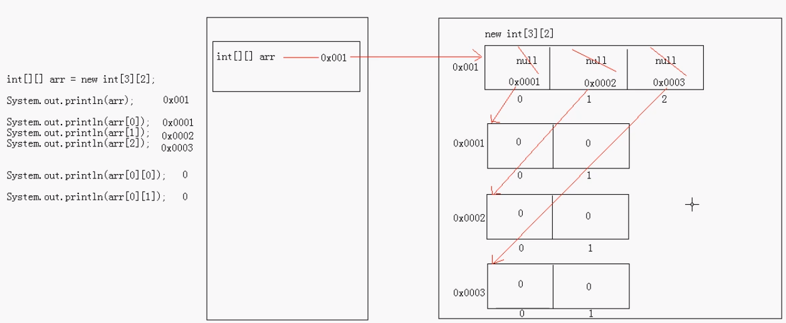

### 格式二

```java
/*
格式二：
	数据类型[][] 数组名=new 数据类型[m][];
	m:表示二维数组中的一维数组个数。
	没有n（列数），也就是说可以动态地给出列数，即列数可变。
*/
class Array2Demo3{
	public static void main(String[] args){
		
		int[][] arr=new int[3][];
		
		System.out.println(arr);//[[I@15db9742
		System.out.println(arr[0]);//null
		System.out.println(arr[1]);//null
		System.out.println(arr[2]);//null
		//System.out.println(arr[1][1]);//java.lang.NullPointerException
		
		//动态地为一维数组们分配空间
		arr[0]=new int[2];
		arr[1]=new int[3];
		arr[2]=new int[1];
		
		System.out.println(arr[0]);//[I@6d06d69c
		System.out.println(arr[1]);//[I@7852e922
		System.out.println(arr[2]);//[I@4e25154f
		
		System.out.println(arr[1][0]);//0
		System.out.println(arr[1][1]);//0
		System.out.println(arr[1][2]);//0
        
        arr[1][0]=100;
		arr[1][2]=200;
	}
}
```

#### 格式二内存图解

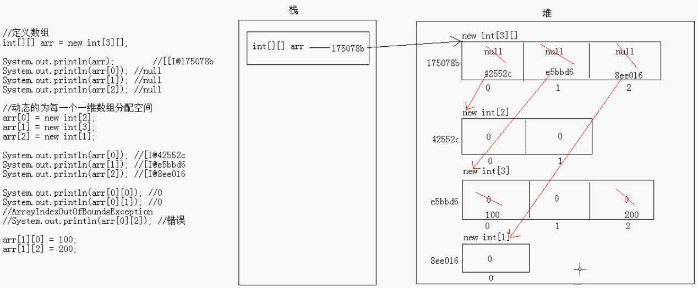

### 格式三

```java
/*
格式三：
	数据类型[][] 数组名=new 数据类型[][]{元素1,元素2,...},{元素1,元素2,...},...,{元素1,元素2,...};
	
	简写形式：
		数据类型[][] 数组名={元素1,元素2,...},{元素1,元素2,...},...,{元素1,元素2,...};
*/

class Array2Demo3{
	public static void main(String[] args){
		
		int[][] arr={1,2,3},{4,5},{6};
		
		System.out.println(arr);
		System.out.println(arr[0]);
		System.out.println(arr[0][1]);
		
	}
}
```

#### 格式三内存图解

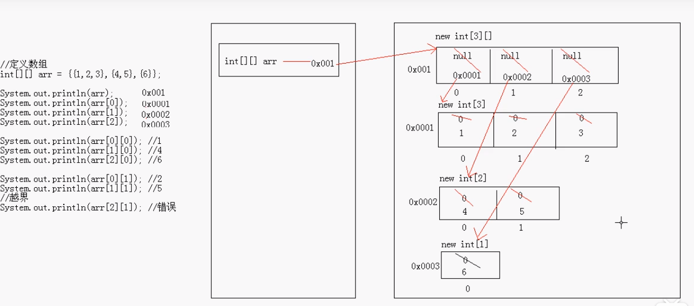

### 练习

```java
class Array2Demo{
	public static void main(String[] args){
		
		//遍历二维数组
		for(int i=0;i<arr3.length;i++){
			for(int j=0;j<arr3[i].length;j++){
				System.out.print(arr3[i][j]+",");
			}
		}
		System.out.println();
		
		Add(arr3);
	}
	//求二维数组中所有元素的和
	public static void Add(int[][] arr){
		int sum=0;
		for(int i=0;i<arr.length;i++){
			for(int j=0;j<arr[i].length;j++){
				sum+=arr[i][j];
			}
		}
		System.out.println(sum);
	}
}
```


# 三、面向对象

## 概述

### 面向过程

举例：

把大象装进冰箱

第一步：把冰箱门打开；

第二步：把大象放进去；

第三步：把冰箱门关上；

很明显，面向过程强调的是过程（动作）。

面向过程的语言：C语言

### 面向对象

顾名思义，强调的是对象（实体）。

冰箱打开

冰箱存储

冰箱关闭

面向对象的语言：C++、Java、C#

#### 特点

1. 面向对象就是一种常见的符合人类思维习惯的编程思路。
2. 面向对象的出现，将复杂的问题简单化。
3. 面向对象的出现，让曾经过程中的执行者，变成了对象中的指挥者。

### 类与对象的关系

类


对象


所以，对象就是一类事物所对应的实实在在的个体。比如汽车这个类对应的对象就是一台实在的汽车。

#### 关系

类：对事物的抽象描述

对象：该类事物的实例，在java中通过new来创建。

```java
/* 
	描述小汽车
	
	分析：
	1.属性
		轮胎数
		颜色
	2.行为
		运行
		
	定义类就是定义成员，成员可以分为：
	成员变量（对应类的属性）；
	成员函数（对应类的行为）。
	
	成员变量和局部变量的区别：
	1.作用域不同：
	成员变量定义在类中，在整个类中都可以访问到；
	局部变量定义在方法、局部代码块、语句中，只在所属区域有效。
	2.存储方式不同：
	成员变量存在于堆内存的对象中；
	局部变量存在于栈内存的方法中。
	3.存在周期不同：
	成员变量随着对象的创建而生成，随着对象的消失而消失；
	局部变量随着所属区域的代码执行而生成，随着代码执行结束而消失。
	4.初始化值不同：
	成员变量都有默认初始化值；
	局部变量没有默认初始化值。
 */
 class Car{
	int num;
	String color;
	void run(){
		System.out.println(num+"...dududududududududu..."+color);
	}
 }
 
 class CarDemo{
	public static void main(String[] args){
		//用new关键字在计算机中创建一个car类的实例
		Car c=new Car();
		/* 
		我们先用new关键字创建了一个car类的实例，小括号里是要参与运算的数据和内容，因为car类不需要数据参与运算，所以为空；
		然后我们需要给这个新创建出来的实例取个名字，用来将它与其他同类的实例区分开。
		最终，我们得到了一个class类型的引用变量 c ，并指向了该class的对象。
		*/
		
		//我们可以修改对象中的内容
		c.num=4;
		c.color="black";
		
		//创建了实例之后，我们还得让它运行起来
		c.run();//要使用对象中的内容，可以通过  对象.成员  的方式来调用。
	}
 }
```


#### 创建对象内存图解


### 匿名对象

```java
/* 
	匿名对象：没有名字的对象
	Car c=new Car();
	c.run();
	可以简写成：
	new Car().run();
	当对象对 方法（run） 仅进行 一次 调用时，可以用匿名对象进行简化。
*/
```


上图中用匿名对象调用num的语句由于没有实际意义，所以在语句运行结束后，堆内存中的对象就会被当做垃圾自动回收。第二句也是。

### 基本类型参数传递和引用类型参数传递


### 封装

#### 代码展示

```java
/* 
	人：
	属性
		年龄
	行为
		说话
 */
 
 /* 
	private:私有，是一个权限修饰符，用于修饰类中的成员。私有的内容只在本类中有效。
	注意：私有是封装的一种表现方式而已。不使用private修饰符一样可以实现封装。只要让你访问不到就好，或者可以扩大范围。
 */
class Person{
	int age;
	void speak{
		System.out.println("age="+age);
	}
	/* public void operate(int a){
		if(a>=0&&a<=200){
			age=a;
		}else{
			System.out.println("您输入的数据错误")
		}
	} 
	然而这种方式不够标准化，所以我们对其进行标准化。
	*/
	public void setAge(int a){//setXxx
		age=a;
	}
	public int getAge(){//getXxx
		return age;
	}
	/* 这两种方法已经形成规范，类中的每个成员变量都要有这两种方法。
	在高级编辑器中通过快捷键可以直接生成，避免了重复劳动。*/
}

class PersonDemo{
	public static void main(String[] args){
		Person p=new Person();
		/*p.age=-20;年龄是没有负值的，所以我们应该防止出现这种情况,于是我们在Person中将用private修饰符来限制访问age，
		并专门定义一个函数operate来对age进行操作*/
		
	}
}
```

#### 思想概述

**封装**是指隐藏对象的属性和实现细节，仅对外提供公共访问方式。

##### 好处

安全性；

复用性；

隔离封装体内部变化，内部的变化并不影响使用就好；

便于使用。

##### 原则

将不需要对外提供的内容都隐藏起来；

把属性都隐藏，提供公共方法对其访问。

##### 注

在java中，最小的封装体是函数，类也是封装体。

### private关键字

#### 概念

是一个权限修饰符；

可以修饰成员（变量和方法）；

被private修饰的成员只有在本类中才能访问；

#### 应用

最常见的应用：

用private修饰成员变量，提供对应的getXxx()、setXxx()方法来对其进行访问；

用private修饰方法并不常见，类中的私有方法如果要在其他类中调用，还需要用一个public权限的方法来调用它。


## 构造函数

```java
class Person{
	private String name;
	private int age;
	//定义一个Person类的构造函数
	/* 
	构造函数：构造、创建对象时调用的函数。
	作用：可以将对象初始化。对象不经初始化无法使用。
	创建函数必须通过构造函数来进行初始化。
	
	一个类中如果没有定义构造函数，那么编译时会自动构建一个空构造函数，
	比如在Person类中就是Person(){}空构造函数。
	如果类中人为定义了构造函数，那么就不会再自动定义空构造函数。
	
	那么一般函数和构造函数有什么区别？
	构造函数：1.创建对象时，就会创建与之对应的构造函数，将对象初始化；
				2.
	一般函数：创建对象后，需要函数功能时才对其进行调用。
	*/
	Person(){//这个构造函数还是空参数的,那么我们默认这个人出生时是没有名字的
		name="baby";
		age=0;
		System.out.println("Person Run");
	}
	//但有的人出生时就有了名字
	Person(String n){
		name=n;
	}
	//有的人出生时就有了名字和年龄（笑）
	Person(String n,int a){
		name=n;
		age=a;
	}
	//在函数中，仅有参数顺序不同的两个函数也是不同的
	Person(int a,String n){
		name=n;
		age=a;
	}
	
	public void speak(){
		System.out.println(name+":"+age);
	}
	public void setName(String n){
		name=n;
	}
	public String getName(){
		return name;
	}
	public void setAge(int a){
		age=a;
	}
	public int getAge(){
		return age;
	}
}

class ConsDemo{
	public static void main(String[] args){
		Person p=new Person();
		Person p1=new Person("LiMing");
		Person p2=new Person("LiMing",12);
		Person p3=new Person(12,"LiMing");
		p.speak();
		p1.speak();
		p2.speak();
		p3.speak();
		
		
	}
} 
```


### 简单定义

构造函数：构造、创建对象时调用的函数。

### 特点

1. 函数名与类名相同；
2. 不用定义返回值类型；
3. 没有具体的返回值；

### 作用

可以将对象初始化。对象不经初始化无法使用。	创建对象必须通过构造函数来进行初始化。

**注：**一个类中如果没有定义构造函数，那么编译时会自动构建一个空构造函数，
比如在Person类中就是Person(){}空构造函数。
如果类中人为定义了构造函数，那么就不会再自动定义空构造函数。	

### 何时用

在创建类来描述事物时，当事物有一些一经诞生就存在的内容时，我们就将这些内容定义在构造函数中。

### 一般函数和构造函数的区别

1. 创建对象时，就会创建与之对应的构造函数，将对象初始化；而一般函数则在创建对象后，需要函数功能时才对其进行调用。
2. 构造函数仅会在每次创建对象时调用一次，而一般函数则是在创建对象后想调用几次就调用几次。

### 重载

构造函数可以有多个，用于对不同的对象进行针对性初始化。

多个构造函数在类中以重构形式存在。

构造函数的重载和一般函数一样，都是在类中定义函数名相同而参数列表不同的函数。这是为了让JVM根据传入参数的不同来调用不同的构造函数。

### 构造函数的内存图解


main函数压栈，在栈内存中创建Person类引用变量p2，在堆内存中创建一个Person类对象，调用构造函数，构造函数压栈，对对象进行初始化，初始化完成，构造函数弹栈；主函数调用Person类中的成员函数speak()，speak()运行结束后弹栈。

### 细节补充

```java
Person(String n){
	name=n;
}

public void setName(String n){
	name=n;
}

```

1.上面的构造函数和setName()成员函数有什么区别？

构造函数只会在创建对象时调用一次，将对象初始化，当初始化完成后，再想对成员变量name进行赋值就不能再调用构造函数，因为再次调用只会也只会创建一个新对象，而不是操作原来的对象；

而setName()成员函数则可以在初始化完成后，任意调用，随意对name进行操作。

2.构造函数可以调用类中的一般方法，如speak()，但一般方法不能调用构造函数。

因为构造函数是用来初始化对象的，如果要调用构造函数，就要创建新对象。如下：

```java
public void speak(){
    new Person();
    System.out.println(name+":"+age);
}
```

3.

```java
void Person(){
		name="baby";
		age=0;
		System.out.println("Person Run");
	}
```

在构造函数名称前加返回值类型修饰符void，会将构造函数变成一般函数。如上的例子中，在创建对象时，就无法对构造函数为空参的对象进行初始化，编译器会报错，无法找到Person()符号。

4.构造函数中有return语句存在，不写就默认顺序执行到代码块末尾，但可以明确写出，但比较少用。比如：

```java
Person(String n,int a){
    	if(a<0){
            return;
        }
		name=n;
		age=a;
	}
```

## 关于对象与对引用对象的理解

Java对象及对象引用

　　首先定义一个简单的类：

```java
　　class User{

　　　　int userId;

　　　　String userName;

　　}
```


　　我们在创建对象时，通常会写：

```java
 　　　User user = new User();
```


　　这个操作包含了四个动作。

　　1）右边的"new User"，是以User为模板，在堆（heap）中创建一个User类对象（也可以说User对象）。

　　2）末尾的()意味着，对象创建后，立刻调用User类的构造函数，对刚生成的对象进行初始化。构造函数肯定是有的，如果你没有写，Java会给你补上默认的构造函数。

　　3）左边"User user"创建了一个User类引用变量。User类引用就是以后可以用来指向User对象的对象引用。

　　3）"="操作符使对象引用指向刚创建的那个User对象。

　　为了更好的理解，拆分成两步：

```java
　　User user;

　　user = new User();　　
```


　　功能效果是一样的，这样就比较清楚了，有两个实体：一个是对象引用变量，一个是对象本身。

　　一般引用是存放在栈（stack），对象存放在堆（heap）。

　　我们创建对象，为什么还要创建对象引用变量？

　　因为创建的User对象是没有名字的，可以认为是User类名称（对象的创建模板）

　　所以一个User类可以据此创建无数个对象，且这些对象不能全叫"User"。

　　我们不能直接访问，只能通过对象引用来间接访问对象。

　　理解到这里，拓展下这里的知识：

```java
　　For Example：

　　User user_1 = new User();

　　User user_2;

　　user_2 = user_1;
```


　　这里解释下，user_2没有指向对象，但是发生了复制行为，要说的是，对象没有被复制，被复制的只是对象引用。结果是，user_2也指向了user_1所指向的对象。

　　以此类推：

```java
　　user_2 = new User();
```


　　则表示user_2引用变量修改指向第二个User对象。

　　得出结论：

　　1）一个对象引用可以指向一个或多个对象

　　2）一个对象可以有N个引用指向它

　　再拓展下：

```java
　　user_1 = user_2;
```


　　现在user_1也指向了第二个User对象，那么第一个User对象呐？因为没有被使用到，就会被Java垃圾回收处理机制回收了，至于什么时候回收，要看垃圾回收机制的策略或者心情了，就是等待JVM回收。

　　以此类推，一些没有引用指向的对象，都会被丢弃，等待JVM回收

```java
　　For Example：

　　new User();

　　System.out.println("Hello World!");
```


## this关键字

### 概念

this就是其所在函数的所属对象的引用。

简单说，哪个对象调用了this所在函数，this就代表哪个对象。

### 使用场景

1. 当成员变量和局部变量重名时，可以在成员变量前加上【this.】，来和局部变量区分开。

   ```java
   Person(String name){
   		this.name=name;
   	}
   ```

   

2. 在构造函数中调用其他构造函数。

   ```java
   	Person(String n,int a){
   		this(name);
   		age=a;
   	}
   /*
   注意：在构造函数内调用其他构造函数时，必须定义在第一行。因为如果定义在后面，可能会覆盖我们传入的参数。所以Java将这一规则内置了，如果不遵守，代码无法通过编译。
   另外也应注意，不要两个构造函数互相调用，形成死循环。这会导致栈内存溢出。
   */
   ```

   

### this内存图解

#### 场景1


主函数压栈，创建引用变量p，堆内存中创建对象1，对象1调用构造函数Person(name)，Person(name)压栈，将对象1的地址值赋给this，根据this的引用，将局部变量name的值赋给对象1中的成员变量name，Person(name)弹栈，对象1初始化完成，对象1的地址值被赋给引用变量p。对象1调用成员函数speak()，speak()压栈，将对象1的地址值赋给this，根据this的引用，打印对象1中的name和age。p1同上。

#### 场景2


主函数压栈，创建引用变量p，堆内存中创建对象1，对象1调用构造函数Person()，Person()压栈，将对象1的地址值赋给this，对象1调用引用的构造函数Person(name)，Person(name)压栈，将对象1的地址值赋给Person(name)中的this，根据this的引用，将局部变量name的值赋给对象1中的成员变量name，Person(name)弹栈，Person(name,age)继续运行，将age的值赋给对象1中的age，Person(name,age)执行完成，Person(name,age)弹栈，对象1初始化完成，对象1调用speak()。speak()压栈，将对象1的地址值赋给this，根据this的引用，打印对象1中的name和age。p1同上。


## static关键字

### 定义及特点

1. static是一个用于修饰成员的修饰符；

2. static修饰的成员被所有同类的对象所共享；比如Person类中所有对象都有一个同样的成员属性country=“CN”，那么为了节省内存空间，我们就可以给country加上static修饰符，让它成为静态成员变量，被所有同类对象共享；

3. static修饰的成员先于对象存在，因为static修饰的成员随着类的加载就已经被创建了；

4. static修饰的成员除了可以被对象调用以外，还可以直接被类调用

   ```java
   System.out.println(Person.country);
   ```

5. static修饰的成员储存的是共享数据，对象中存储的是对象特有的数据。


### 存在的意义

静态变量：关键词——资源利用效率

让该变量属性成为类中的共享数据，只要该类存在，就一直存在于内存中，从而节省内存空间。而不用在每个对象中都重复创建这个变量，浪费内存空间。

静态函数：关键词——通过对象调用函数的必要性

让该方法随该类一起被加载进内存，且只要该类存在，该方法就一直存在，并且可以直接用类名调用，十分方便。将工具类中的函数定义为静态函数，就是因为工具类中没有任何非静态成员变量（所以成员方法不可能调用非静态方法），只有成员方法，该类的对象也就不会封装有任何特有数据，只是一个空对象白白占用内存空间，所以创建该类的对象没有意义。	那么我们可以将该类中的成员函数定义为静态函数，直接通过类名调用这些函数。

**个人猜测：**将一些被调用的频率较高的函数定义为静态函数，可以提高资源的使用效率。如果将这些函数定义为非静态函数，那么就需要创建对象来对其进行调用，那么就可能会出现对象反复被创建和垃圾回收的情况，浪费资源。


### 静态变量和成员变量的区别

**本质区别：**

静态成员与类挂钩，是存储、操作类中的共有数据的；

非静态成员与对象挂钩，是存储、操作对象中的特有数据的。

创建对象需要对应的类被加载进内存，那么静态成员就已经和类一起被加载进了内存。而非静态成员是需要通过对象去调用的，所以非静态成员可以访问已经存在与内存中的静态成员。反之，则不行。

1.**生命周期不同**

静态变量随着类的创建而存在，随着类的消失而消失；

成员变量随着对象的创建而存在，随着对象被回收而消失；

2.**调用方式不同**

静态变量可以被类名和对象调用；

成员变量只能被对象调用；

3.**别名不同**

静态变量又叫类变量；

成员变量又叫实例变量；

4.**数据的存储位置不同**

静态变量存储在方法区（共享数据区）中的静态区，所以也叫对象的共享数据；

成员变量存储在堆内存中的对象里，所以也叫对象的特有数据。

### 使用静态的注意事项

1.静态方法只能访问静态成员（包括成员变量和成员方法），无法访问非静态成员，非静态方法既可以访问静态成员，又可以访问非静态成员。

```java
	public static void show(){
		System.out.println(country+":"+name);
	}
/* 
	在成员函数show()中加入static关键字，编译器会报错：无法从静态上下文中引用非静态 变量 name
	因为静态成员是随着类的加载而生成并且就可以被调用了，是先于对象存在的，而成员变量name是存在于对象中的，
	所以可能会出现调用静态函数show()时，name还不存在的情况，所以java就设定了规则，让编译器不予通过，
	以杜绝这种情况的发生。
*/
```

2.静态方法中不能使用this或super关键字。同样是因为，静态方法随着类的加载而生成，先于对象存在，而this关键字就是指向其引用对象的，那么如果没有对象就无法引用，所以在java中不允许这样使用。

3.主函数是静态的。

```java
class StaticDemo{
	int num=4;
	public static void main(String[] args){
		//show();直接调用不行，编译时会报错，因为静态方法无法调用非静态方法。
		new StaticDemo().show();//所以我们可以创建一个对象，让对象来调用show()方法。
	}
	public void show(){
		System.out.println(num);
	}
}
```


### main函数解析

### 特点

1.主函数有固定的格式；

```java
class MainDemo{
	public static void main(String[] args){
		
	}
}
```


2.主函数被JVM所识别和调用。

### 主函数解析

public：公共的，要给主函数最大的访问权限；

static：不需要创建对象，直接用主函数所属类名进行调用，方便JVM的调用；

```
java MainDemo.main(.main省略不写)
```

void：主函数没有具体的返回值，因为方法的返回值是返回给调用者，而main方法被JVM调用，把值返给JVM没有意义；

main：不是关键字，只是一个JVM能识别的固定的名字，一个常见的方法入口；

String[] args：这是主函数的参数列表，是一个元素为字符串类型的数组类型参数，args是这个参数的名字，是arguments的缩写，是一个约定俗成的名字，其实是可以自己命名的。

**注意**

```java
public static void main(int[] args){
    
}
//这不是主函数，只是名为main的函数，JVM不会将它当作程序的入口

public static void main(String[] x){
    
}
/* 这样就会报错：
	MainDemo.java:32: 错误: 已在类 MainDemo中定义了方法 main(String[])
        public static void main(String[] x){
        因为JVM不知道该从哪个入口进入。
	*/
```


### 参数解析

```java

class MainDemo{
	public static void main(String[] args){
		System.out.println(args);
		/* 结果：[Ljava.lang.String;@15db9742
			[代表数组；L表示参数很长；
			java.lang.String代表java.lang包中的String包，也代表数组中的元素类型是String；
			@15db9742是实体存储的地址的哈希值。
			以上结果证明JVM在调用主函数时确实给main方法传了一个元素是字符串类型的数组实体进去。
		*/
		
		//那么这个数组有长度吗？
		System.out.println(args.length);
		/* 结果：0 
			这说明JVM传了 new String[0] 这样一个参数。
			这似乎没有意义。
			但之所以主函数中有这样一个参数列表，是为了让我们在运行java程序的时候可以传入一些我们需要的参数，
			这是给使用程序的人留下的入口。
			而之所以选择用String[]类型的参数，是因为字符串可以兼容数字，字母等类型的数据，可以将字符串转换为其他类型的数据，
			所以字符串是最通用的数据类型；而为了满足用户传入多个数据的需求，我们选择了元素类型为字符串的数组String[]。
		*/
		
		/* 那么我们怎么传入参数呢？我们在控制台直接传入参数 
			我们直接在控制台键入：java MainDemo haha hehe xixi（想要传入的参数）
			我们遍历一下这个参数列表，发现与我们刚刚传入的参数一致。
		*/
		for(int i=0;i<args.length;i++){
			System.out.println(args[i]);
		}
	}
}
```

**那么我们怎么传入参数呢？**

我们在控制台直接传入参数。我们输入：java MainDemo haha hehe xixi（想要传入的参数）

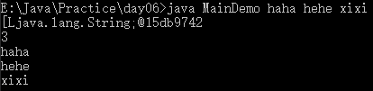

### 加入了静态成员的内存图解

例一：

```java
class Person{
	private String name;
	private int age;
	static String country="CN";
	public Person(String name,int age){
		this.name=name;
		this.age=age;
	}
	public void show(){
		System.out.println(Person.country+":"+this.name+":"+this.age);
		//此处各个成员前的Person. this. 可以省略，但写上可以提高代码的可读性。
	}
	public static void method(){
		System.out.println(country);
	}
}
class StaticDemo2{
	public static void main(String[] args){
		Person.method();
		/* method方法在其他类中，若其为非静态则要调用必须通过对象；
		若其为静态，则要调用可以通过类名和对象。 */
		Person p=new Person("java",20);
		p.show();
	}
}
```

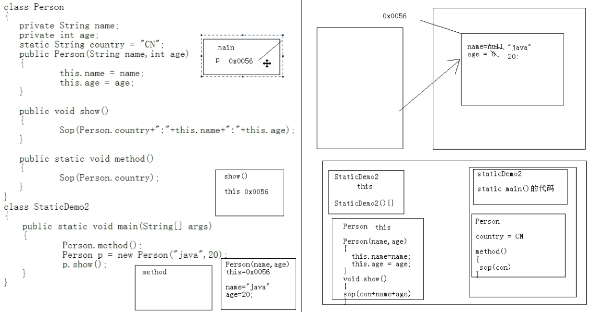

当我们在控制台输入了 java StaticDemo2 命令执行 StaticDemo2类 的时候，这个类就进内存中的方法区了，该类中的StaticDemo2(){} 默认构造函数也一同被加载进来了。主函数main方法（及其代码）也被加载进了方法区中的静态方法区。以上加载完毕后，JVM就开始根据类名调用main主函数，main主函数压栈，开始执行main函数中的代码。

执行 Person.method(); 要用到Person类，这时，Person才开始加载。JVM会去classpath路径下找Person的类文件，如果没有设置classpath，就会再当前目录寻找，找到后将其加载进内存。其中，构造函数Person(String name,int age)、成员函数show()加载进非静态方法区，静态方法method()和静态成员country加载进静态方法区。JVM在静态方法区找到method()方法，method()压栈，调用方法区中的代码运行结束后，method()方法弹栈。

执行Person p=new Person("java",20); 在栈中的分配给main主函数的内存空间中，创建一个引用变量p，在堆中，开辟空间创建一个对象，在对象的内存空间中创建成员属性name和age，并初始化为默认值，然后调用构造函数Person(String name,int age)，构造函数压栈，构造函数中的this指向该对象，构造函数的内存空间中创建局部变量name和age并为他们赋值，然后开始执行方法区中已经加载的Person(String name,int age)函数代码，将局部变量name和age的值赋给对象中的成员变量name和age。构造函数运行完毕，弹栈。等号右侧的代码运行完毕，把对象的首地址值赋给等号左侧的引用变量p。

执行p.show();  通过对象调用show()，JVM到到非静态方法区找到show()的代码，让show()压栈，给this赋首地址值，指向该对象。show()方法运行完毕，弹栈。

main主函数运行完毕，弹栈。

（方法区就是代码存放区，又叫方法表，就是存放方法以及静态成员的地方；栈属于运行区，栈里存放的是方法运行所需的局部变量。

非静态方法区和静态方法区中的方法都是被共享的，只是调用他们的办法不同，非静态方法只能被对象调用，静态方法能被对象和类名调用。）

例二：

```java
/*
	定义一个人类
	
	姓名和年龄都是变化的，这个我能接收，因为每个人的姓名和年龄是不同的。
	但是，我们现在选取的几个人都是中国人，他们的国籍是一样的。
	一样的国籍，我每次创建对象，在堆内存都要开辟这样的空间，
	我就觉得有点浪费了。怎么办呢? 
		针对多个对象有共同的这样的成员变量值的时候，
		Java就提高了一个关键字来修饰：static。
*/
class Person {
	//姓名
	String name;
	//年龄
	int age;
	//国籍
	//String country;
	static String country;
	
	public Person(){}
	
	public Person(String name,int age) {
		this.name = name;
		this.age = age;
	}
	
	public Person(String name,int age,String country) {
		this.name = name;
		this.age = age;
		this.country = country;
	}
	
	public void show() {
		System.out.println("姓名："+name+",年龄："+age+",国籍："+country);
	}
}

class PersonDemo {
	public static void main(String[] args) {
		//创建对象1
		Person p1 = new Person("邓丽君",16,"中国");
		p1.show();
		
		//创建对象2
		//Person p2 = new Person("杨幂",22,"中国");
		//p2.show();
		Person p2 = new Person("杨幂",22);
		p2.show();
		
		//创建对象3
		//Person p3 = new Person("凤姐",20,"中国");
		//p3.show();
		Person p3 = new Person("凤姐",20);
		p3.show();
		
		p3.country = "美国";
		p3.show();
		
		p1.show();
		p2.show();
	}
}
```


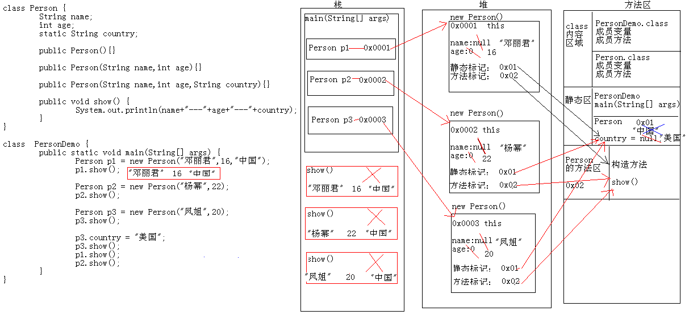

### 什么时候使用静态修饰符？

1.静态变量

类是对事物的抽象，对象是抽象的类所对应的实例。类中定义有成员变量和成员函数，分别用来描述事物的属性和功能。当某种属性是该类的所有对象都具备且**它们的值也一模一样**的，那么我们就可以用静态修饰符static来修饰该成员变量，让它成为静态变量，为所有同类对象共享，这样可以节约内存空间，提高内存使用的效率。

2.静态函数

当类中的成员函数需要访问非静态成员变量（即特有数据），该成员函数就必须是非静态函数。换言之，在同类中，静态函数无法调用非静态成员。

当**同类**中的成员函数不需要访问非静态成员，只需要访问静态变量或“haha”、233这种已经确定的数据或其他静态函数时，该函数就可以定义成静态函数。当然也可以定义为非静态函数，但调用非静态函数一定要通过对象，而对象又是用来封装特有数据的，而该函数又没有访问特有数据，所以这个对象的创建就是毫无意义且浪费资源的，因此我们选择将这种没有访问非静态成员的函数定义为静态函数。

跨类调用时，一些使用频率比较高的工具类方法，我们可以将之定义为静态方法，但不推荐多用。因为，Java毕竟是面向对象的语言，其次静态方法会与该类一同加载进内存并与类一同存在，如果静态方法过多会占用较多的内存空间。

综上，是否将该函数定义为静态函数，本质上取决于通过对象去调用它是否有必要，有意义。如果该函数调用了非静态变量，那么该类的对象中就会封装它所调用的特有数据，那么通过对象调用它就有意义，所以我们把它定义为非静态变量。当然在java中用静态方法调用非静态变量是无法通过编译的。而如果该函数没有调用非静态成员变量，那么显然对象中就没有封装它所访问到的数据，那么通过对象去调用它显然多此一举，所以我们将它定义为静态函数。

**疑问：**但是从内存利用效率上看，定义过多的静态函数显然也是不恰当的，因为如果该函数被调用的频率很低，却一直停留在内存中占用空间，显然是一种浪费。但是从效率的角度看，具体该如何选择应该还有结合JVM的运行机制来分析，所以在此处我们先打个问号。


### 静态代码块

```java
/* 
	静态代码块：
	static{}
	随着类的加载而执行，且在该类存续期间只执行一次。
	
	用处：
	用于对类进行初始化。一般用于所有成员均为静态的类。
	因为对于所有成员均为静态的类，没有必要去创建对象，那么也就无法调用构造函数初始化对象中的成员。
	所以我们可以用静态代码块来对类中的成员进行初始化，且可以进行多步骤的复杂操作。
	
 */
class StaticCode{
	static int num;
	static{
		num=10;
		num+=10;
		System.out.println(num);
	}
	static void show(){
		System.out.println("hello");
	}
}
class StaticCodeDemo{
	public static void main(String[] args){
		StaticCode.show();
	}
}
```


### 构造代码块

```java
/*
构造代码块：
	class Demo{
		{}这是构造代码块
		
		public void func(){
			{}这是局部代码块
		}
	}
	构造代码块随着对象的创建而执行，每创建一个对象，就会执行一次，且先于构造函数执行。
	
	作用：用来给对象进行初始化。
	构造代码块初始化的成员一般是该类对象所共有的成员，而构造函数所初始化的成员是某些特定的该类对象所对应的成员。
*/
class Person{
	private String name;
	
	{
		cry();//所有宝宝出生都会哭。
	}
	public void cry(){
		System.out.println("哭得哇哇得！");
	}//此时name的值还是null，所以说明构造函数还没压栈执行。
	
	//有的宝宝出生没名字（对特定的对象的成员进行初始化）
	Person(){
		this.name="baby";
	}
	
	//有的宝宝出生有名字（对特定的对象的成员进行初始化）
	Person(String name){
		this.name=name;
	}
	public void loud(){
		System.out.println(name);
	}
}
class StaticCodeDemo{
	public static void main(String[] args){
		Person p=new Person();
		p.loud();
		Person p1=new Person("LiMing");
		p1.loud();
	}
}
```


#### 小案例

```java
/*
	写程序的执行结果。
	
	输出结果如下：
	
	林青霞都60了，我很伤心
	我是main方法
	Student 静态代码块
	Student 构造代码块
	Student 构造方法
	Student 构造代码块
	Student 构造方法
*/
class Student {
	static {
		System.out.println("Student 静态代码块");
	}
	
	{
		System.out.println("Student 构造代码块");
	}
	
	public Student() {
		System.out.println("Student 构造方法");
	}
}

class StudentDemo {
	static {
		System.out.println("林青霞都60了，我很伤心");
	}
	
	public static void main(String[] args) {
		System.out.println("我是main方法");
		
		Student s1 = new Student();
		Student s2 = new Student();
	}
}
```


### 工具类

#### 定义

该类中没有任何非静态成员变量（所以成员方法不可能调用非静态方法），只有成员方法，这种类我们将之称为工具类。

#### 写法

该类的对象也就不会封装有任何特有数据，只是一个空对象白白占用内存空间，所以创建该类的对象没有意义。
那么我们可以将该类中的成员函数定义为静态函数，直接通过类名调用这些函数。

#### 使用方式

这样一个工具类，可以为其他程序所用，直接将.class类文件传送给他人，供其调用即可。
但是，其他人如何知道这个类提供了什么样的方法呢？又该如何调用呢？函数名是什么？
为了解决这个问题，Java提供了文档注释功能和javadoc程序来生成说明文档。

想要用.class文件中的方法，需要将该.class文件与主函数所在的.class文件放到统一目录下，或者手动配置classpath路径，`set classpath=.;要用的class文件所在绝对目录`。

### 文档注释

格式：`/**  */`


## 小案例


```java
/* 
	主函数类
	
	我们把之前学过的理顺一下发展思路
 */
class ArrayToolDemo{
	public static void main(String[] args){
		//获取数组中值最大的元素
		int[] arr=new int[]{3,6,9,4,2,3,454};
		/* int maxIndex=0;
		for(int i=1;i<arr.length;i++){
			if(arr[i]>arr[maxIndex]){
				maxIndex=i;
			}
		} 
		System.out.println("max="+arr[maxIndex]);
		
		*/
		
		int max=getMax(arr);
		System.out.println("max="+max);
		
		ArrayTool tool=new ArrayTool();
		String str=tool.arrayToString(arr);
		System.out.println("arr="+str);
		
		tool.selectSort(arr);
		String str1=tool.arrayToString(arr);
		System.out.println("arr="+str1);
		
	}
	
	/*上面这种方式复用性差，且主函数是用来调用方法的，不是用来给你写方法的。
		所以我们学了函数，用函数来封装代码，用主函数调用函数。
	*/
	public static int getMax(int[] arr){
		int maxIndex=0;
		for(int i=1;i<arr.length;i++){
			if(arr[maxIndex]<arr[i]){
				maxIndex=i;
			}
		}
		return arr[maxIndex];
	}
	/* 
		上述方法在本类中解决了在数组中获取最值的问题，但如果我们在别的类中也需要这种功能怎么办呢？
		如果我们需要更多的对数组进行操作的功能呢？
		于是我们想到刚学过的面向对象思想。我们把操作数组的各种功能封装到一个类中，那么我们需要这些功能的时候，
		只需要根据类这张图纸，创建一台具有这些功能的机器（对象），然后使用这台机器（对象）即可。
		所以我们创建一个新的类文件。
		
	*/
}
```


```java
/* 
	工具类
	
		
 */
 
 /**
	建立了一个用于操作数组的工具类。其中包含常见的数组操作方法，如：取数组中最值、排序等。
	@author Acangga
	@version v1.0
 */
 
public class ArrayTool{
    /*
    如果要将类文档化，这个类就一定要是公共的，所以用public修饰该类。
	且因为用了public修饰该类，所以java源文件的名称一定要和类名一致。
    */
    
	//为了保证不让其他成员创建该类对象，可以将构造函数私有化，让其他成员无法访问该类的构造函数，也就无法创建对象了。
	private ArrayTool(){}
	
	/**
	取数组中最大值
	@param arr 接收一个元素类型为int的数组
	@return 该数组中值最大的元素
	*/
		public int getMax(int[] arr){
		int maxIndex=0;
		for(int x=1;x<arr.length;x++){
			if(arr[maxIndex]<arr[x]){
				maxIndex=x;
			}
		}
		return arr[maxIndex];
	}
	
	/**
	查找某数据是否存在于数组中，若存在则获取其索引。
	@param arr 接收一个元素类型为int的数组
	@param key 要查找的数据
	@return 若数组中存在该数据，则返回对应元素的索引；若不存在，则返回-1。
	*/
	public int getIndex(int[] arr,int key){
		for(int x=0;x<arr.length;x++){
			if(key==arr[x]){
				return x;
			}
		}
		return -1;
	}
	
	/**
	对数组进行选择排序。
	@param arr 接收一个元素类型为int的数组
	*/
	public void selectSort(int[] arr){
		for(int x=0;x<arr.length-1;x++){
			int num=arr[x];
			int index=x;
			for(int y=x+1;y<arr.length;y++){
				if(num>arr[y]){
					num=arr[y];
					index=y;
				}
			}
			swap(arr,x,index);
		}
		
	}
	/**
	交换数组中两个元素的位置。
	@param arr 接收一个元素类型为int的数组
	@param x 其中一个元素的索引
	@param y 另一个元素的索引
	
	javadoc只能识别public和protected权限的函数，private权限的无法被识别。
	所以此处没必要写文档注释。
	*/
	private void swap(int[] arr,int x,int y){
		int temp=arr[x];
		arr[x]=arr[y];
		arr[y]=temp;
	}
	
	/**
	将int[]转换成String类型，格式是{e1,e2,...}。
	@param arr 接收一个元素类型为int的数组
	@return str 返回该数组的字符串形式
	*/
	public String arrayToString(int[] arr){
		String str="{";
		for(int x=0;x<arr.length;x++){
			if(x!=arr.length-1){
			str=str+arr[x]+",";
			}else{
			str=str+arr[x]+"}";
			}
		}
		return str;
	}
}
```


## 补充——Java 中 field 和 variable 区别及相关术语解释

先说一下 field 和 variable 之间的区别：

> class variables and instance variables are fields while local variables and parameter variables are not. All fields are variables.

成员变量（field）是指类的数据成员，而方法内部的局部变量（local variable）、参数变量（parameter variable）不能称作 field。field 属于 variable，也就是说 **variable 的范围更大。**

## 术语解释：

1. **域或字段、实例变量、成员变量** （field, instance variable, member variable, non-static field）

   > field: A data member of a class. Unless specified otherwise, a field is not static.

   - 非 static 修饰的变量。
   - 虽然有如上定义，但是一般在使用时，成员变量（field）包括 instance variable 和 class variable。为了区分，个人认为，用实例变量/非静态变量（instance variable / non-static field）描述上面的定义更佳。
   - 成员变量与特定的对象相关联，只能通过对象（new）访问。
   - 声明在类中，但不在方法或构造方法中。
   - 如果有多个对象的实例，则每一个实例都会持有一份成员变量，实例之间不共享成员变量的数据。
   - 作用域比静态变量小，可以在类中或者非静态方法中使用以及通过生成实例对象使用。（访问限制则不可用）
   - JVM在初始化类的时候会给成员变量赋初始值。

   Example:

   ```
     public class FieldTest {
          private int Xvalue; // Xvalue  is a field
          public void showX() {
               System.out.println("X is: " + xValue);
          }
     }
   ```

**2. 类字段、静态字段、静态变量**（class variable, static field, staic variable）

- 使用 static 修饰的字段，一般叫做静态变量。

- 声明在类中，但不在方法或构造方法中。

- 多个实例对象共享一份静态变量

- JVM在准备类的时候会给静态变量赋初始值。

- 作用域最大，类中都可以访问，或通过 类名.变量名 的方式调用（访问限制则不可用）。

  Example:

  ```
  System.out.println(Integer.MAX_VALUE);
  ```

**3. 局部变量**（local variable）

- 定义在一个区块内（通常会用大括号包裹），没有访问修饰符，区块外部无法使用的变量。

- 没有默认值，所以必须赋初始值

- 生命周期即为方法的生命周期

  Example:

  ```
  if(x > 10) {
      String local = "Local value";
  }
  ```

**4. 参数**（input parameter, parameter (variable), argument）

参数，这个就不多说了，要注意的是 argument 和 parameter 的区别（下文）。
另外，Oracle 官方将参数分为了构造参数、方法参数和异常参数三部分。 Example:

```
    public class Point {
        private int xValue;
        public Point(int x) {
            xValue = x;
        }
        public void setX(int x) {
            xValue = x;
        }
    }
```

> Strictly speaking, a parameter is a variable within the definition of a method. An argument would be the data or actual value which is passed to the method. An example of parameter usage: `int numberAdder(first, second)` An example of argument usage: `numberAdder(4,2)`

**parameter是形式参数，argument是实际参数。**

**5. 不可变量、常量**（final variable, constant）

使用 final 关键词修饰的变量。不可变量属于成员变量。

**6. 成员**（member）

> A field or method of a class. Unless specified otherwise, a member is not static.

指的是类中非静态的成员变量或方法。（用法同field）

**7. 属性**（property）

> Characteristics of an object that users can set, such as the color of a window.

可被用户设置或获取的对象特征即为属性。
POJO 或 JavaBean 中的成员变量也称作属性（具有set、getter方法）。

补充了这些，想问问大家，重写（Override）、重载（Overload）你掌握的如何？是否又听说过 Java 中的隐藏（Hide）、遮蔽（Shadow）、遮掩（obscure）机制？

**最后，总结一下国内目前的惯用法**（英文取其一，序号对应上文）：

1. field -> 成员变量， instance variable / non-static field -> 实例变量/非静态变量
2. class variable -> 静态变量
3. local variable -> 局部变量
4. input parameter -> 参数
5. final variable -> 常量
6. member -> 成员（用法同field）
7. property -> 属性

## JDK提供的帮助文档——Java API 说明书

### 如何下载

1. 登录Oracle官网（https://www.oracle.com/）。

2. 进入Java页面。

   


3. 将页面拉到底部


4. 页面中间

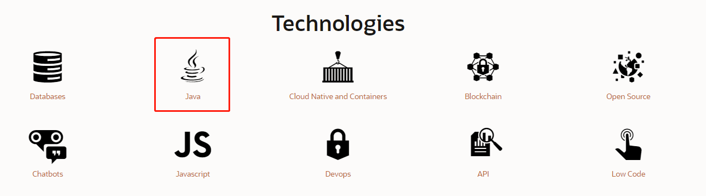

5. 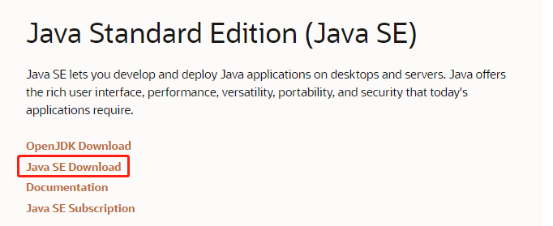
6. 

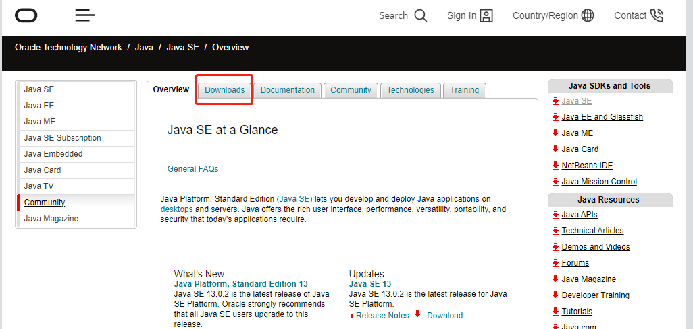

7. 下拉

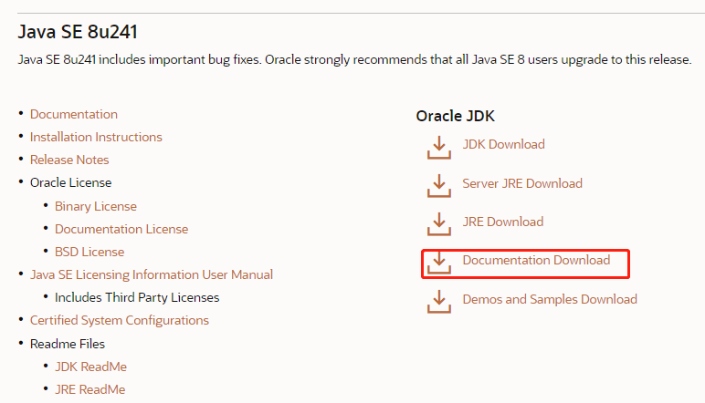

8. 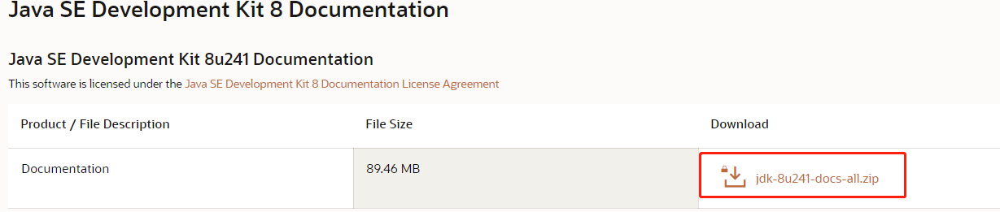

9. 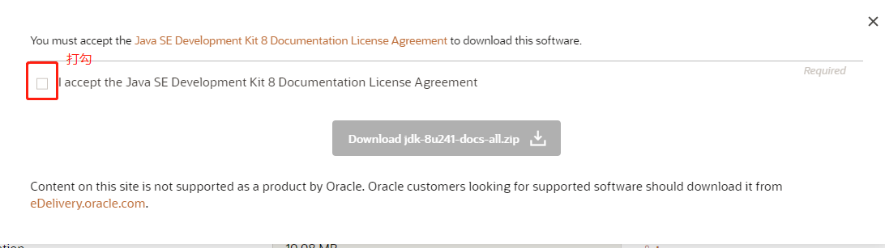

10. 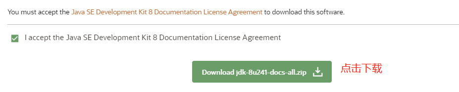

11. 下载完成后解压到任意目录；打开doc\api目录，打开index页面，尽情享受即可。

### 如何使用

1. 搜索想要了解的类、方法的关键字。

2. 查看其所在的包，因为除了java.lang包中的类以外，其余均需导入。

3. 查看该类的版本，确定自己当前使用的java版本已经包含了该类。

4. 读读说明

5. 看该类的结构：

	- 构造方法==》Constructor Summary

	- 成员变量==》Field Summary

	- 成员方法==》Method Summary

6. 看构造方法

	- 有构造方法：根据构造方法的说明创建对象
	
	- 没构造方法：成员可能都是静态的
	
7. 看成员方法

	- 看Modifier and Type（修饰符和返回值类型）
	
	- 看Method and Description，可以得知该方法的名称、参数列表和功能

#### 补充：All Methods

- Concrete Methods (Not Abstract Methods)
  - Static Methods
  - Instance Methods
- Abstract Methods

### 练习：随机数游戏

```java
/*
目标：通过API文档学习使用math类中的方法，来生成一个随机数。

1. 找到math类
2. math类属于java.lang包，无需导包
3. 看版本
4. 看math类的结构，没构造函数，所有成员都是静态
5. 看method summary，找到可以生成随机数的方法
6. 找到random()方法，
7. 研究random()的修饰符、返回值类型、和参数列表
8. 在程序中调用random()

*/
import java.util.Scanner;

class MathDemo{
	public static void main(String[] args){
		/* double a=Math.random();
		System.out.println(a);
		
		//再生成一百个零到一百间的随机数
		for(int i=0;i<100;i++){
			int b=(int)(Math.random()*100)+1;
			System.out.println(b);
		} */
		new MathGame().game();
		
	}
}

/*
我们再来做一个猜随机数的小游戏
分析：
	创建一个0-100的随机整数a
	输入一个整数b
	
	判断b==a
	如果相等，输出“你猜对了”
	如果b>a，输出“大了”
	如果b<a，输出“小了”
	
	循环上述过程，直到a==b为true
	因为循环次数未知且判断条件复杂，所以用死循环
	
*/
class MathGame{
	public static void game(){
		int a=(int)(Math.random()*100)+1;
		for(;;){
			System.out.println("请输入你猜的数字:");
			Scanner s=new Scanner(System.in);
			int b=s.nextInt();
			if(b==a){
				System.out.println("你猜对了");
				return;
			}else if(b>a){
				System.out.println("大了");
			}else{
				System.out.println("小了");
			}
		}
	}
}
```


## 继承

有时候一些类中具有同样的成员，就需要重复写相同的代码，比较麻烦。所以我们考虑能不能把这些成员分离出来，给这些类共同使用。如果进一步考虑如何实现，我们想到可以将这些相同的成员封装在一个类中，然后在需要使用这些成员的多个类和这一个类之间构造一种关系即可。Java就给我们提供了这样一种方式——**继承**。

### 概念

多个类中存在相同的属性和行为，将这些属性和行为抽取到单独的一个类中，那么多个类就无需再定义这些属性和行为，只需继承这个类即可。

单独的这个类成为父类、基类或超类；

这多个类称为子类或派生类。

子类可以在继承父类的基础上再定义自己的新成员。

### 实现方式

`extends`关键字

### 格式

```java
/*
class 父类名称{}
class 子类名称 extends 父类名称{}
*/

class Person{
	String name;
	int age;
	/* Person(String name,int age){
		this.name=name;
		this.age=age;
	} 构造方法的使用方法见后文 
	*/
	public void eat(){
		System.out.println("eat");
	}
	public void sleep(){
		System.out.println("sleep");
	}
	public void show(){
		System.out.println(name+":"+age);
	}
}

class Student extends Person{
	
}
class Teacher extends Person{
	
}

class ExtendsDemo{
	public static void main(String[] args){
		Student s=new Student();
		s.eat();
		s.sleep();
		Teacher t=new Teacher();
		t.eat();
		t.sleep();
	}	
}
```

### 优点

1. 提高了代码复用性：多个类中相同的成员可以抽取到一个类中；
2. 提高了代码的可维护性：如果成员代码需要修改，只需修改父类中的代码即可；
3. 让类与类之间产生了联系，是多态的前提：这也是继承的弊端之一，因为继承提高了类的耦合性。

### 弊端

1. 提高了类的耦合性。
2. 打破了类的封装性。

### 耦合、内聚

耦合：类与类之间的关系。

内聚：自己完成某件事的能力。

开发原则：低耦合，高内聚。

### 特点

1. Java中只支持单继承，不支持多继承。

但有些语言是支持多继承的，格式：`extends class1,class2,...`

2. Java支持多层继承，爷传子，子传孙。

```java
class GrandFather{
	void show(){
		System.out.println("I'm your grandfahter.");
	}
}
class Father extends GrandFather{
	void method(){
		System.out.println("I'm your fahter.");
	}
}
class Son extends Father{
	
}

class ExtendsDemo2{
	/* ExtendsDemo2.java:17: 错误: 需要<标识符>
        s.show();
	总忘记写主函数…… */
	public static void main(String[] args){
		Son s=new Son();
		s.show();//爷爷的
		s.method();//爸爸的
	}	
}
```

### 补充：访问权限

如果没有写就是默认访问权限

java的类有2种访问权限，public、默认

而方法和变量有4种：public、默认、protected、private

其中默认访问权限和protected很相似，有着细微的差别。

public意味着任何地方的其他类都能访问
默认则是同一个包的类可以访问。
protected表示同一个包的类可以访问，其他的包的该类的子类也可以访问。
private表示只有自己类能访问。

### 注意事项

1. 子类只能继承父类所有非私有的成员（成员变量、成员方法）。
2. 子类不能继承父类的构造方法，但可以通过super关键字（见后文）访问父类的构造方法。
3. 不要为了部分功能而去继承。

```java
class A{
    void show1();
    void show2();
}
class B{
    void show2();
    void show3();
}
//我们发现class B 中有跟class A 一样的方法show2()，于是我们想到继承。
class B extends A{
    void show3();
}
/*
这样其实不好，因为你不光继承了show2()，你还继承了shwo1()，show1()有可能不是你想要的。
*/
```

### 使用场景

继承其实体现了一种从属关系（A is a B.）。

比如：

Person

​	Student

​	Teacher

水果

​	苹果

​	香蕉

所以我们再考虑是否该使用继承的时候可以进行假设，如果A类是B类的一种，或者B类是A类的一种，就可以考略使用继承。

### super关键字

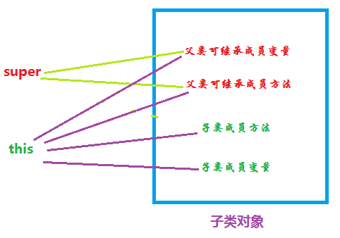

#### this和super的对比

#### 概念

this代表本类对应的引用；

super代表父类存储空间的标识（也可以理解为父类的引用，可以操作父类的成员）；

#### 应用

1. 调用成员变量
   - this.成员变量名：调用本类成员变量
   - super.成员变量名：调用父类成员变量
2. 调用构造方法
   - tihs(args)：调用本类构造方法
   - super(args)：调用父类构造方法
3. 调用成员方法
   - this.成员方法：调用本类成员方法
   - super.成员方法：调用父类成员方法

### 对象实例化过程

创建子类对象时是不会创建父类对象的，只不过是调用父类构造方法来初始化父类属性。

这些父类属性是和子类的属性储存在同一片内存空间的。

### 继承中成员间的关系

类由成员变量、成员方法、构造方法组成。那么引入了继承关系之后，父类和子类中的各个组成部分之间有怎样的关系呢？

#### 成员变量

1. 父类和子类中的成员变量名称不一样时
   - 父类中的成员用this、super或不用关键字（编译器自动添加）都可以访问。
   - 子类中的成员则须用this关键字或不用关键字访问。
2. 父类和子类中的成员变量名称一样时
   - 父类成员用super关键字访问
   - 子类成员用this关键字（显式或隐式）访问
3. 父类和子类中的成员变量名称一样而没有用super或this特别指明引用时，在访问时的查找顺序如下：
   - 在子类的局部查找，找到就访问；
   - 在子类的成员范围查找，找到就访问；
   - 在父类的成员范围查找，找到就访问；
   - 如果还找不到，就报错。
4. 父类和子类中的成员变量名称一样而想直接精准访问时，
5. 如果成员变量（或方法）是私有的，就不能被继承，用子类无法访问。

```java
class Father{
    int num=1;
    void method(){
		int num=5//方法不经调用时不会压栈的，所以也无法访问到这个num
	}
}
class Son extends Father{
    int num2=2;
    int num=3;
	void show(){
		int num=4;
		System.out.println(num);
		System.out.println(num2);
	}
}

class ExtendsDemo3{
	public static void main(String[] args){
		Son s=new Son();
		s.show();
	}
}
```


#### 成员方法

1. 子类中方法的声明和父类中方法的声明（函数名、返回值类型、参数列表）不一样

```java
class Father{
	void show(){
		System.out.println("父类show方法");
	}
}
class Son{
	void method(){
		System.out.println("子类method方法");
	}
}

class ExtendsDemo4{
	public static void main(String[] args){
		Son s=new Son();
		s.method();
		s.show();
	/*
	结果：
	子类method方法
	父类show方法
	*/
	}
}
```

2. 子类中方法的声明和父类中方法的声明一样

用子类调用成员方法时，JVM会先在子类中查找方法，如果有就调用，否则就去父类中查找，如果有就调用，否则就会报错。

```java
class Father{
	void show(){
		System.out.println("父类show方法");
	}
}
class Son{
	void method(){
		System.out.println("子类method方法");
	}
	void show(){
		System.out.println("子类show方法");
	}
}

class ExtendsDemo4{
	public static void main(String[] args){
		Son s=new Son();
		s.method();
		s.show();
	/*
	结果：
	子类method方法
	子类show方法
	*/
	}
}
```

#### 

#### 构造方法

1. 子类中所有的构造方法都会默认访问父类中的空参数构造方法。

为什么呢？

因为子类会继承父类中的数据，可能还会使用父类的数据。所以，子类初始化之前，一定要先完成父类数据的初始化。

也因此，每一个子类构造方法的第一条语句默认都是：super()。

2. 那么如果父类中没有空参的构造函数呢？

   怎么会没有空参的构造函数呢？不是默认存在的吗？

   如果你在父类中只定义了一个有参数的构造函数，那么编译器就不会再添加默认的空参构造函数，那么父类中就只有一个有参数的构造函数了。

   比如：

   ```java
   class Father{
       Father(String name){
           System.out.println("Father的有参构造函数");
       }
   }
   class Son{
       Son(){
           System.out.println("Son的无参构造函数");
       }
       Son(String name){
           System.out.println("Son的有参构造函数");
       }
   }
   ```

   在上述情况下，父类中就没有了无参构造函数。而子类构造函数中默认自带的super()是调用父类的无参构造函数的，所以编译时就会报错。

   那么怎么解决呢？

   1. 在父类中增加一个无参构造函数；
   2. 在子类构造函数中用super关键字含参数显示调用父类中的有参构造函数；

   ```java
   class Father{
       Father(String name){
           System.out.println("Father的有参构造函数");
       }
   }
   class Son{
       Son(){
           super("随便给参数");
           System.out.println("Son的无参构造函数");
       }
       Son(String name){
           super("随便给参数");
           System.out.println("Son的有参构造函数");
       }
   }
   ```

   3. 在子类中用this关键字去调用本类中其他的能够成功访问父类构造函数的构造方法，相当于一种间接调用的方法。

   注意，用这种方法时，用this关键字访问的构造方法一定要能够访问父类的构造方法，否则父类中的数据无法完成初始化，代码也就无法通过编译。

   ```java
   class Father{
       Father(String name){
           System.out.println("Father的有参构造函数");
       }
   }
   class Son{
       Son(){
           super("随便给参数");
           System.out.println("Son的无参构造函数");
       }
       Son(String name){
           this();
           System.out.println("Son的有参构造函数");
       }
   }
   ```

   注意：this()或super()一定要放在作用域的第一条语句位置，因为如果放在其他语句之后，编译器会人为子类构造函数没有super()语句，没有调用父类的构造函数，会自动加上super(),那么就会导致父类数据的多次初始化，这样时无法通过编译的。

#### 方法重写

##### 概述

子类中出现了和父类中一模一样的方法声明，也被称为方法覆盖，方法复写。

##### 应用

当子类需要父类的功能，而功能主体子类有自己特有内容时，可以重写父类中的方法，这样，即沿袭了父类的功能，又定义了子类特有的内容

```java
//方法重写

class Phone{
	void call(String name){
		System.out.println("呼叫"+name);
	}
}

class NewPhone extends Phone{
	void call(String name){
		super.call(name);
		System.out.println("通话记录：你给"+name+"打了电话");
	}
}

class ExtendsDemo5{
	public static void main(String[] args){
		NewPhone np=new NewPhone();
		np.call("LiMing");
	}
}
```

##### 注意事项

1. 父类中的私有方法不能被重写。因为私有方法只能在本类中访问。
2. 子类重写父类方法时，子类中方法的访问权限不能低于父类中的对应方法。最好子类和父类保持一致。
3. 对于父类中的静态方法，子类中也必须用静态方法重写，否则会报错。父类中的非静态方法，在子类中用静态方法重写会报错。（其实这算不上方法重写，但看起来形式一样，具体内容见将在多态中讲解）。

##### 两道面试题

1：方法重写和方法重载的区别?方法重载能改变返回值类型吗?

方法重写：
	在子类中，出现和父类中一模一样的方法声明的现象。
	
方法重载：
	同一个类中，出现的方法名相同，参数列表不同的现象。


方法重载能改变返回值类型，因为它和返回值类型无关。


Override：方法重写
Overload：方法重载

2：this关键字和super关键字分别代表什么?以及他们各自的使用场景和作用。

this:代表当前类的对象引用
super:代表父类存储空间的标识。(可以理解为父类的引用，通过这个东西可以访问父类的成员)

场景：
	成员变量：
		this.成员变量：访问当前类的成员变量
		super.成员变量：访问父类中的成员变量
	构造方法：
		this(...)：本类的构造方法
		super(...)：父类的构造方法
	成员方法：
		this.成员方法：访问当前类的成员方法
		super.成员方法：访问父类的成员方法

### 案例

#### 1. 老师、学生

```java
/*
应用继承写一个demo
就用Teacher类和Student类来继承Person类

Person类的构成
成员变量：name、age
构造函数：空参、带参
成员函数：getXxx、setXxx

*/
class Person{
	private String name;
	private int age;
	Person(){
		
	}
	Person(String name,int age){
		this.name=name;
		this.age=age;
	}
	
	void setName(String name){
		this.name=name;
	}
	String getName(){
		return name;
	}
	
	void setAge(int age){
		this.age=age;
	}
	int getAge(){
		return age;
	}
}

class Student extends Person{
	Student(){
		
	}
	Student(String name,int age){
		super(name,age);
		/* 
		this.name=name;
		this.age=age;
		这样写会的话，该构造方法会去调用父类的无参构造方法，
		成员变量name和age的值会被初始化为默认值null和0。
		所以我们用super关键字显式调用父类的带参构造函数。
		*/
	}
}

class Teacher extends Person{
	Teacher(){
		
	}
	Teacher(String name,int age){
		super(name,age);
	}
}


class ExtendsTest{
	public static void main(String[] args){
		//学生类
		//测试方法一
		Student s=new Student();
		s.setName("LiMing");		
		s.setAge(12);		
		System.out.println("学生："+s.getName()+":"+s.getAge());
		//测试方法二
		Student s1=new Student("LiMing",12);
		System.out.println("学生："+s1.getName()+":"+s1.getAge());
		
		//老师类
		//测试方法一
		Teacher t=new Teacher();
		t.setName("Jenny");
		t.setAge(18);
		System.out.println("老师："+t.getName()+":"+t.getAge());
		//测试方法二
		Teacher t1=new Teacher("Jenny",18);
		System.out.println("老师："+t1.getName()+":"+t1.getAge());
		
	}
}
```

#### 2. 猫、狗

```java
/*
抽象分析：
1. 我们往往是先观察具体的事物，观察他们的属性和行为；
2. 将事物抽象为类，将属性和行为抽象为成员变量和成员方法（可能还有静态变量和方法），
	其实在这里该事物的类就已经可以定义出来了，不过我们要使用继承，所以要分别定义父类和子类；
3. 从变量和方法中寻找共性，用共性定义父类。
4. 共性以外即为特性，子类继承父类，再加上特性就可以定义出继承中的子类了。
5. 具体代码实现中还要定义出各类的构造函数。

案例分析：
1. 观察猫和狗的属性和行为
猫
属性：名字、年龄、品种
行为：吃饭、玩

狗
属性：名字、年龄、品种
行为：吃饭、看家

2. 抽象为类

Cat
field:name,age,breed
function:eat();play();setXxx();getXxx

Dog
field:name,age,breed
function:eat();guard();setXxx();getXxx

3. 定义父类

Animal
field:name,age,breed
constructor:param,non-param
function:eat();setXxx();getXxx

4.定义子类（继承+特性）

Cat extends Animal
field:nothing
constructor:param,non-param
function:play()

Dog extends Animal
field:nothing
constructor:param,non-param
function:guard()

*/

class Animal{
	private String name;
	private int age;
	private String breed;
	Animal(){
		
	}
	Animal(String name,int age,String breed){
		this.name=name;
		this.age=age;
		this.breed=breed;
	}
	void eat(){
		System.out.println(getName()+"：我吃我吃我吃吃吃！");
	}
	void setName(String name){
		this.name=name;
	}
	String getName(){
		return name;
	}
	void setAge(int age){
		this.age=age;
	}
	int getAge(){
		return age;
	}
	void setBreed(String breed){
		this.breed=breed;
	}
	String getBreed(){
		return breed;
	}
}

class Cat extends Animal{
	/* 
	 错误: 无法将类 Object中的构造器 Object应用到给定类型;
                super(name,age,breed);
                ^
	需要: 没有参数
	找到: String,int,String
	原因: 实际参数列表和形式参数列表长度不同
	
	不要忘记写extends */
	Cat(){
		
	}
	Cat(String name,int age,String breed){
		super(name,age,breed);
	}
	
	void play(){
		System.out.println(this.getName()+"：我玩我玩我玩玩玩！");
		/* System.out.println(super.getName()+"：我玩我玩我玩玩玩！");
		这里用this和super都一样，它们指向的都是同一块内存空间，同一个对象。
		
		void play(Cat c){
		System.out.println(c.getName()+"：我玩我玩我玩玩玩！");
	} 
		所以没有必要再像上面那样写，把当前对象传递进来。
		*/
		
	}
	/* 
	直接调用getName()即可。getName()其实是省略写法，这里其实是super.getName()。
	所以当对象调用到play()时，执行输出语句，调用super.getName()，去父类中寻找
	*/
}
class Dog extends Animal{//不要忘记写extends
	Dog(){
		
	}
	Dog(String name,int age,String breed){
		super(name,age,breed);
	}
	void guard(){
		System.out.println(getName()+"：我守我守我守守守！");
	}
}

class ExtendsTest2{
	public static void main(String[] args){
		//Cat
		//方法一
		Cat c0=new Cat();
		c0.setName("Tom");
		c0.setAge(3);
		c0.setBreed("American Shorthair");
		c0.eat();
		c0.play();
		/*System.out.println(name+":"+age+":"+breed);
		这几个成员变量在Animal类中都是私有的，要访问需要通过调用setXxx()和getXxx()方法。
		*/
		System.out.println(c0.getName()+":"+c0.getAge()+":"+c0.getBreed());
		//方法二
		Cat c1=new Cat("DD",3,"British Shorthair");
		c1.play();
		System.out.println(c1.getName()+":"+c1.getAge()+":"+c1.getBreed());
		
		//Dog
		//方法一
		Dog d0=new Dog();
		d0.setName("Bruce");
		d0.setAge(2);
		d0.setBreed("Cokey");
		d0.guard();
		System.out.println(d0.getName()+":"+d0.getAge()+":"+d0.getBreed());
		//方法二
		Dog d1=new Dog("PP",1,"Border collie");
		d1.guard();
		System.out.println(d1.getName()+":"+d1.getAge()+":"+d1.getBreed());
	}
}
```


### final关键字

#### 背景

在继承中，父类中的方法可以被子类重写，那如果我们不想让父类中的方法被重写的话，该如何保护它呢？

同样，如果我们不想让一个类被其他类继承，我们该如何控制？

我们不想让一个变量被重新赋值，该如何控制？

Java为我们提供了final关键字。

#### 概述

final关键字是最终的意思，可以修饰类、方法、变量。

- 用final修饰类：该类成为最终类，不能被其他类继承。

- 用final修饰方法：该方法不能被重写。

- 用final修饰变量：该变量就成为了常量，只能被赋值一次。

```java
//final 修饰类
final class Father{
	int a=1;
}

class Son extends Father{
	
}
/* 错误: 无法从最终Father进行继承
class Son extends Father{  */


//用final修饰方法
class Mother{
	String a="String";
	final void show(){
		System.out.println(a);
	}
}

class Daughter extends Mother{
	void show(){
			System.out.println("lalalalalala");
	}
	/* 错误: Daughter中的show()无法覆盖Mother中的show()
        void show(){
             ^
  被覆盖的方法为final */
}

class FinalDemo{
	public static void main(String[] args){
		final int x=1;
		x=10;
		/* 错误: 无法为最终变量x分配值
                x=10; */
	}
}
```


#### 两个问题

##### final修饰局部变量

```java
class Father{
	int age=50;
}

class FinalTest{
	public static void main(String[] args){
		//基本类型的变量：不可以被重新赋值
		
		final int x=1;
		
		//x=10;
		/* 
		错误: 无法为最终变量x分配值
                x=10;
		*/
		
		//引用类型的变量：变量所指向的实例包含的成员变量可以被重新赋值，但该引用变量的首地址值不能被重新赋予。
		final Father f=new Father();
		System.out.println(f.age);
		f.age=500;
		System.out.println(f.age);
		//成员变量age可以被重新赋值
		
		f=new Father();
		/* 错误: 无法为最终变量f分配值
                f=new Father(); 
		
		此语句想要让该引用变量指向另一个实例，即重新赋予它另一个首地址值，这是不可以的
				*/
		
	}
}
```

##### 对被final修饰的变量进行初始化的时机

```java
class Father{
	
	final int age=50;//可以在声明变量时直接进行初始化
	
	final int height;
	{
		height=185;//可以在构造代码块中进行初始化
	}
	
	final int weight;
	Father(){
		weight=80;//可以在构造函数中进行初始化
	}
	
	final String birthday="123";
	{
		birthday="19680419";
	}
	Father(){
		birthday="19680420";
	}
	/* 错误: 可能已分配变量birthday
                birthday="19680420"; 
				
	但不能在构造代码块和构造函数中都对变量进行初始化
	*/
}

/* 
	何时对被final修饰的变量进行初始化？
	
	非静态：
	在构造函数结束前对其进行初始化即可。
	因为无论如何，即使你不给成员变量赋值，构造函数也会对成员变量进行默认初始化，
	给它们赋默认值，那么一旦构造函数运行结束，初始化完成，	由于被final修饰的变量只能被赋值一次，
	你就无法再给被final修饰的变量赋值了，所以我们要在构造函数定义完之前，给被final修饰的成员变量赋值。
	
	静态：
	因为静态变量随着类的加载就已经被加载进内存了，那么当时就已经完成了初始化，无法再被初始化，
	所以被final修饰的静态变量最好在声明时直接进行初始化。
	

*/

class FinalTest2{
	public static void main(String[] args){
		
	}
}
```


## 多态

### 概念

在编程语言和类型论中，多态（英语：polymorphism）指为不同数据类型的实体提供统一的接口。多态类型（英语：polymorphic type）可以将自身所支持的操作套用到其它类型的值上（通过继承构建多态）。

计算机程序运行时，相同的消息可能会送给多个不同的类别之对象，而系统可依据对象所属类别，引发对应类别的方法，而有不同的行为。简单来说，所谓多态意指相同的消息给予不同的对象会引发不同的动作。

多态也可定义为“一种将不同的特殊行为和单个泛化记号相关联的能力”。

多态可分为变量多态与函数多态。变量多态是指：基类型的变量（对于C++是引用或指针）可以被赋值基类型对象，也可以被赋值派生类型的对象。函数多态是指，给相同的函数调用界面（函数名与实参表）传送一个对象变量，可以有不同的行为，这视该对象变量所指向的对象类型而定。因此，变量多态是函数多态的基础。

### 存在条件

1. 有继承关系
2. 有方法重写
   - 其实没有方法重写也可以，但没有意义。因为如果没有方法重写，同一个接口使用同一父类的不同子类的实例就会引发相同的动作。
3. 父类引用指向子类对象`Father f=new Son()`

### 多态方式下访问成员时的特点

1. 成员变量

使用多态方式访问成员变量时，首先检查父类中有没有该成员变量，如果没有，则编译错误，如果有，则访问父类中的该成员变量。
即，编译看父类，访问看父类。

2. 成员方法

使用多态方式访问成员方法时，首先检查父类中有没有该成员方法，如果没有，则编译错误，如果有，再去调用子类中的同名方法，
如果子类中有该同名方法，则编译通过，调用子类中的该同名方法（因为方法重写覆盖了父类中的同名方法），如果没有，则编译报错。
即，编译看父类，运行看子类。

3. 构造方法

创建子类对象的时候，JVM会访问父类的构造方法，初始化父类的数据。

4. 静态方法

静态方法不具备多态性。因为静态方法只与类相关联，无论引用变量实际指向的是什么类型的对象，程序运行的都是声明该引用变量时所声明的类型。

```java
class Father{
	int num=1;
	void show(){
		System.out.println("show(Father)");
	}	
	static void method(){
		System.out.println("static method(Father)");
	}
	/*如果将上面的代码注释掉，编译时会报错：
	PolyDemo.java:24: 错误: 找不到符号
                System.out.println(f.num);//result:1
                                    ^
	符号:   变量 num
	位置: 类型为Father的变量 f
	PolyDemo.java:25: 错误: 找不到符号
                f.show();//result:show(Son)
                 ^
	符号:   方法 show()
	位置: 类型为Father的变量 f
	PolyDemo.java:26: 错误: 找不到符号
                f.method();//result:static method(Father)
                 ^
	符号:   方法 method()
	位置: 类型为Father的变量 f
	
	由此可知，使用多态方式访问成员变量、成员方法和静态方法时，都会先去父类中寻找对应的成员变量、成员方法和静态方法。
	如果找不到，则无法通过编译。
	
	*/
}

class Son extends Father{
	int num=10;
	void show(){
		System.out.println("show(Son)");
	}
	static void method(){
		System.out.println("static method(Son)");
	}
}

class PolyDemo{
	public static void main(String[] args){
		Father f=new Son();
		System.out.println(f.num);//result:1
		f.show();//result:show(Son)
		f.method();//result:static method(Father)
	}
}
```

### 多态的优点

1. 提高了代码的可维护性（见继承）。
2. 提高了代码的扩展性。

```java
//多态带来的可扩展性
//动物案例

class Animal{
	void eat(){
		System.out.println("eat");
	}
	void sleep(){
		System.out.println("sleep");
	}
}

class Cat extends Animal{
	//继承+方法重写
	void eat(){
		System.out.println("猫吃鱼");
	}
	void sleep(){
		System.out.println("猫蜷着睡");
	}
}
/*
我们每定义一种动物，就需要创建类、继承、方法重写。
*/

class PolyDemo2{
	public static void main(String[] args){
		Cat c=new Cat();
		c.eat();
		c.sleep();
		/*
		那么如果我们要这只猫或许多只猫重复进行吃饭、睡觉的活动，就要重复调用Cat类中的成员函数，比较麻烦。
		所以我们考虑用函数将调用eat()和sleep()的功能封装起来，但把这个函数定义在哪个类中都不太合适，所以我们创建一个工具类来实现该功能。
		*/
		Cat c1=new Cat();
		Tool.catFunc(c1);
		/*
		Cat类的问题解决了。但是如果我们想让更多的Animal类的子类都能使用Tool类呢？
		我们可以每次创建了新的子类都在Tool类中添加上对应的方法，但这样既麻烦，也会由于频繁修改，导致工具类出错的可能性大增。
		那该怎么办？
		我们考虑可以事先把所有动物的对应方法都在Tool类中定义好，即穷举法。但是这好像不太现实，而且工作量太大了。
		所以我们考虑运用多态来解决这个问题。即，我们不再逐个定义不同动物的对应函数，而是只定义操作动物类的函数，将不同种类的动物都用动物类
		的方式来操作即可。代码见AnimalTool类。
		*/
		Cat c2=new Cat();
		AnimalTool.animalFunc(c2);
		
	}
}

/* class Tool{
	public static void catFunc(Cat c){
		c.eat();
		c.sleep();
	} */
	
class AnimalTool{
	public static void animalFunc(Animal a){
			a.eat();
			a.sleep();
	}
}
/*
该工具类是如何构成和体现多态的？

继承：Cat类是Animal类的子类
方法重写：Cat类重写了Animal类中的eat()和sleep()
父类引用指向子类对象：AnimalTool的参数列表是Animal类的引用类型变量，但实际传入的确实Animal类的子类的引用类型变量。
*/

```

### 多态的弊端

只能访问父类中定义了的方法在子类中的重写方法，无法调用子类的特有方法。

如何解决？

- 重新创建一个子类对象，通过它来调用子类的特有方法。

这种方法多创建了一个实例，浪费了内存空间。

- 运用向下转型，将父类的引用类型变量赋值给子类的引用类型变量。

### 向上转型和向下转型

```java
class Father{
	void show(){
		System.out.println("show(Father)");
	}
}

class Son extends Father{
	void show(){
		System.out.println("show(Son)");
	}
	void method(){
		System.out.println("only method(Son)");
	}
}

class PolyDemo3{
	public static void main(String[] args){
		//向上转型：相当于儿子穿父亲的衣服，化妆为父亲
		Father f=new Son();
		f.show();
		//f.method();
		/*
		PolyDemo3.java:20: 错误: 找不到符号
                f.method();
                 ^
		符号:   方法 method()
		位置: 类型为Father的变量 f
		1 个错误
		*/
		
		//向下转型
		Son s=(Son)f;
		s.method();
		/* 
		因为f实际上是Son类的实例的引用变量，所以可以向下转型。
		*/
	}
	
}
```

### 多态内存图解

向上转换：

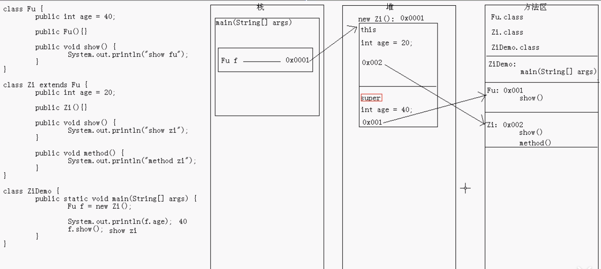

向下转换：

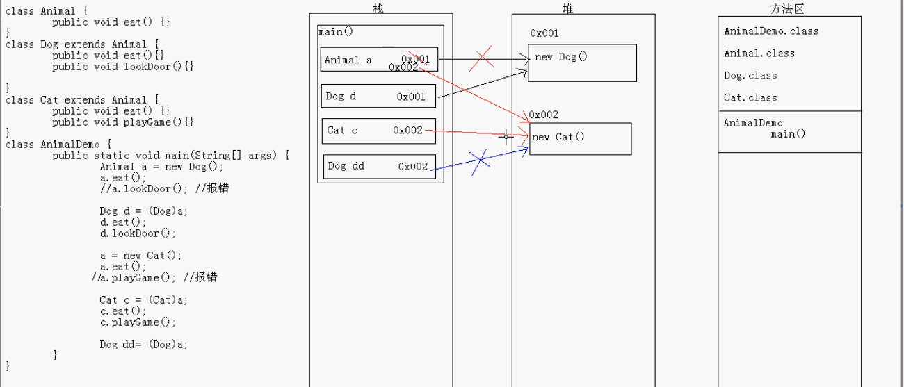

```java
//ClassCastException：类指向错误

class Animal{
	void eat(){
		
	}
}

class Cat extends Animal{
	void eat(){
		
	}
	void play(){
		
	}
}

class Dog extends Animal{
	void eat(){
		
	}
	void guard(){
		
	}
}


class PolyTest{
	public static void main(String[] args){
		//内存中的实例为狗
		Animal a=new Dog();//向上转换
		a.eat();
		Dog d=(Dog)a;//可以向下转换
		
		//内存中的实例为猫
		a=new Cat();
		Dog dd=(Dog)a;//无法转换
		/* 编译不报错，运行报错如下：
		Exception in thread "main" java.lang.ClassCastException: Cat cannot be cast to Dog（猫无法被指向狗）
        at PolyTest.main(PolyTest.java:35)
		*/
	}
}
```

### 练习

```java
/*
	看程序写结果:先判断有没有问题，如果没有，写出结果
	
	多态的成员访问特点：
		方法：编译看左边，运行看右边。
		
	继承的时候：
		子类中有和父类中一样的方法，叫重写。
		子类中没有父亲中出现过的方法，方法就被继承过来了。
*/
class A {
	public void show() {
		show2();
	}
	public void show2() {
		System.out.println("我");
	}
}
class B extends A {
	/*
	public void show() {
		show2();
	}
	*/

	public void show2() {
		System.out.println("爱");
	}
}
class C extends B {
	public void show() {
		super.show();
	}
	public void show2() {
		System.out.println("你");
	}
}
public class DuoTaiTest4 {
	public static void main(String[] args) {
		A a = new B();
		a.show();
		
		B b = new C();
		b.show();
	}
}
```


## 抽象类

### 概述

从我们前面多次见到的动物案例中可以看出，单纯的动物类其实是没什么实际意义的，它并没有对应的实体，也就没有创建对象的意义，它只是一种人为抽象出的概念。属于动物类的猫、狗等才有实际意义，有创建对应对象的意义。我们可以称动物类这种认为抽象出来的概念类型为抽象类。

既然创建动物类这种抽象类没有意义，那么我们就想阻止使用者这么做。我们可以通过让抽象类中所有方法都出错来达到目的，但这样就需要先运行程序才能得到错误信息，浪费时间和资源。所以我们希望在编译时就能得到错误信息。

为此，Java提供了一种叫做“抽象方法（函数）”的机制。这种函数是不完整的，只有声明而没有方法体，如下：

```java
abstract void functionName();//这叫没方法体
abstract void functionName(){};//这叫有方法体，只是方法体为空
```
Java用抽象方法来表明、限定抽象类，并且提供了`abstract`关键字。

### 特点

1. 没有实际意义，无法创建实例。
	- 但抽象类也有构造函数，用于创建子类对象时初始化父类的数据。
2. 抽象方法和抽象类都由`abstract`关键字修饰。
3. 包含抽象方法的类必然是抽象类。抽象类也可以不包含抽象方法。
	- 当一个类包含任何抽象方法都没意义，但我们也无需创建该类的对象时，就可以将之定义为抽象类。
4. 如果要继承抽象类，创建它的子类，可以分为两种情况。
	- 在子类中重写该抽象类中的抽象方法，为其提供方法定义（因为有了具体定义就不是抽象方法，所以无需也不能用abstract关键字修饰该成员方法），这样可以得到一个可以实例化的子类。
	- 不在子类中重写抽象方法，这样得到的子类也是一个抽象类（且必须用abstract修饰，否则编译时报错）。
5. 我们无法直接实例化抽象类，但是可以通过多态的方式来实例化它的子类，从而实现间接实例化抽象类。

#### 示例

```java
abstract class Animal{
	abstract void eat();
	abstract void sleep();
	void breath(){
		System.out.println("breath");
	}	
}

abstract class Cat extends Animal{
	
}

class Dog extends Animal{
	void eat(){
		System.out.println("Dogs eat meat.");
	}
	void sleep(){
		System.out.println("Dogs sleep on the ground.");
	}
}

class AbstractDemo{
	public static void main(String[] args){
		//Animal a=new Cat(); Cat是抽象的; 无法实例化
		Animal a=new Dog();
		a.eat();
		a.sleep();
		a.breath();
	}
}
```

